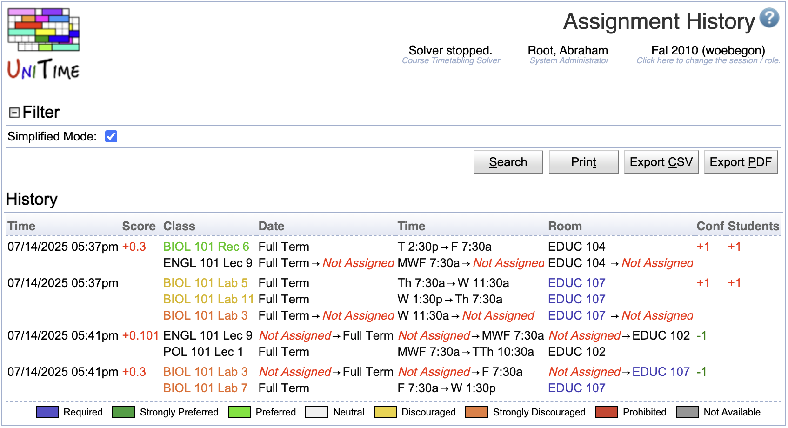

## Screen Description

The Assignment History screen provides a list of all changes in the class assignments made manually using [Suggestions](suggestions) screen since the timetable was created/loaded (and there is a line for each change made using the [Suggestions](suggestions) page). Click on any of these changes to see a suggestion that will "undo" this change.

{:class='screenshot'}

## Details

### Filter

The only item in this section is

* **Simplified mode**
	* When checked, only additional student conflicts are displayed for each change

### History

A list of changes in time/room assignment that includes a time stamp for each of them. Click on any of these changes to see a suggestion that will "undo" this change.

## Operations

* **Search**
    * Apply the changes made to the filter, and refresh the list of changes

* **Print**
    * Print the list of changes

* **Export CSV**
    * Export the list of changes to a CSV document

* **Export PDF**
    * Export the list of changes to a PDF document
