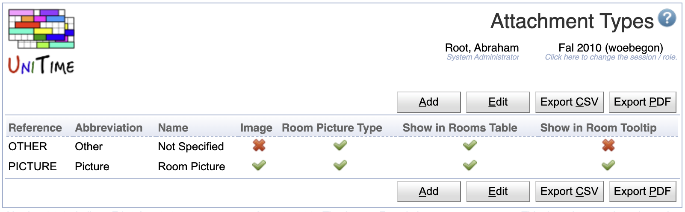
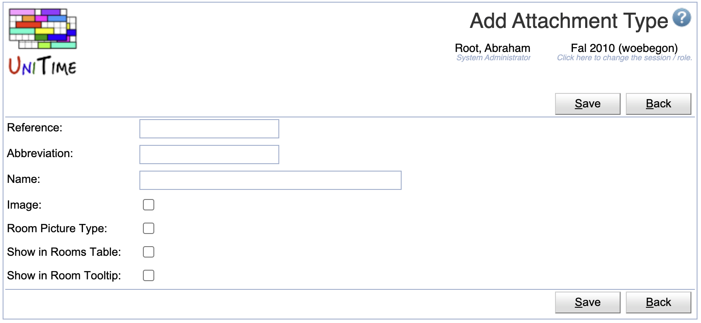
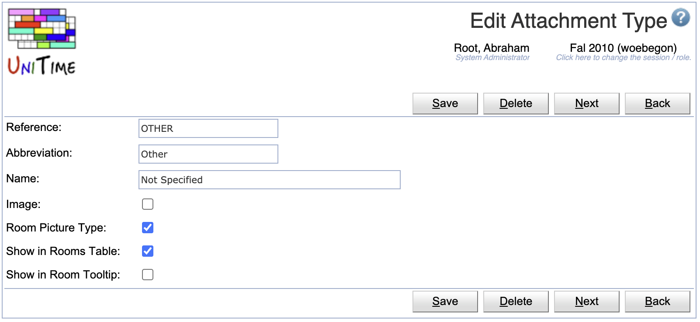
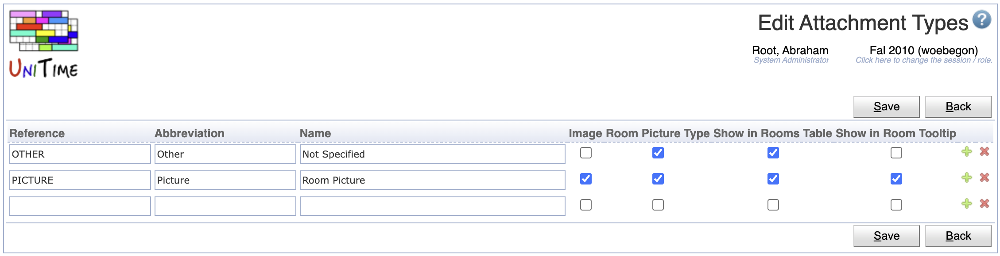

## Screen Description

Starting with UniTime 4.1, other files than pictures can be attached to a room. To avoid issues with UniTime trying to show a file as a picture, a new attachment types table have been created.

{:class='screenshot'}

These attachment types can be defined on the Administration > Other > Attachment Types administrative page. Each type has the following properties:

* **Reference**: unique reference of the type
* **Abbreviation**: abbreviation of the type
* **Name**: name of the type, e.g., used on the [Edit Room](edit-room) page
* **Image**: the file can be displayed as an image (in the IMG element)
* **Room Picture Type** this attachment type can be used on the Add/Edit Room page
* **Show in Rooms Table**: files of this type can be shown in the [Rooms](rooms) table
* **Show in Room Tooltip**: images of this type can be show in the room’s mouse over tooltip

## Notes

In the Rooms table, every attachment type that is used and allowed to be displayed will show as a separate column. Files that are not images will show as links (named after the name of the attached file).

## Operations

The table can be sorted by any of its columns, just by clicking on the column header and the sorting option that opens.

### Add Attachment Type
Click **Add** to add a new attachment type

{:class='screenshot'}

* Click **Save** to create a new attachment type
* Click **Back** to return to the list without making any changes

### Edit Attachment Type
Click a particular attachment type to make changes or to delete the attachment type.

{:class='screenshot'}

* Click **Save** to make changes, **Back** to return to the list without making any changes
* Click **Previous** or **Next** to save the changes and go to the previous or next attachment type, respectively
* Click **Delete** to delete the attachment type.

### Edit Attachment Types
Click **Edit** to edit all attachment types

{:class='screenshot'}

* Use the  icon to add a new line and  to delete a line
* Click **Save** to make changes, **Back** to return to the list without making any changes

### Export CSV/PDF
Click the **Export CSV** or **Export PDF** to export the list of attachment types to a CSV or PDF document, respectively.

