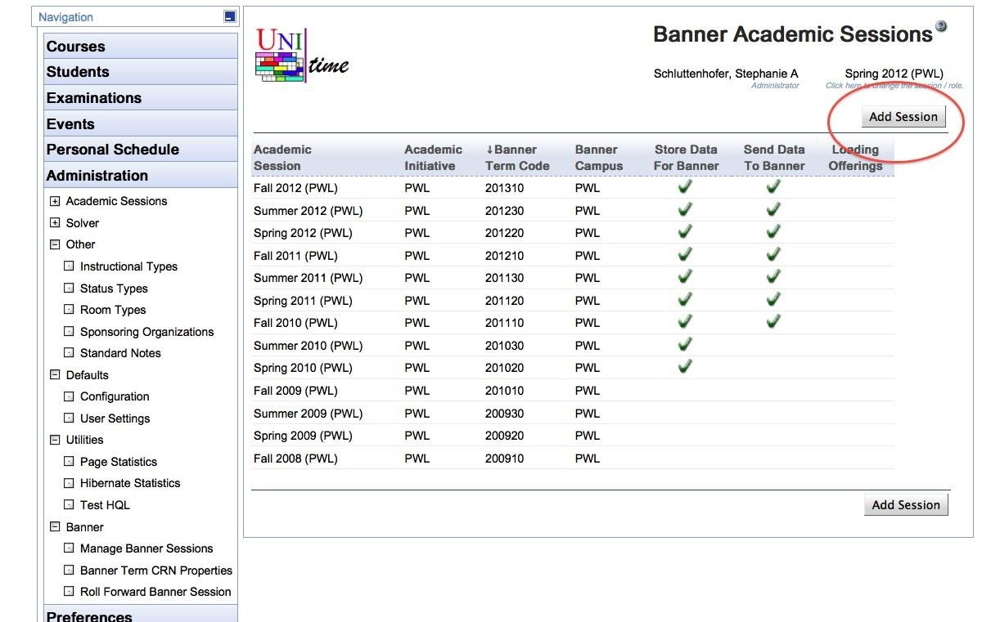

## Screen Description
The Banner Academic Sessions page allows defining Banner-related data for each academic session.

{:class='screenshot'}
Once a session is set to store data for Banner, whenever a change is made to a course, CRNs are automatically generated for all classes within the course.  If the courses are structured, the appropriate link identifiers are automatically created to tie the Banner sections together.  If a course is cross-listed, multiple banner sections are created for the course and they are automatically tied together with appropriate cross-list identifiers.

## Details

For each UniTime session you wish to store data for Banner you will need to add a corresponding Banner session.

* **Academic Session**
	* The UniTime academic session

* **Banner Term Code**
	* The code used in Banner to identify a session, i.e. 201220

* Banner Campus

* **The string used to identify the campus in Banner.**

* **Store Data for Banner**
	* Whenever a change is made to a course in UniTime, store the appropriate data that is needed for Banner.

* **Send Data to Banner**
	* Whenever a change is made to a course in UniTime, send the appropriate data to Banner.  This is often turned off during session setup until Banner is ready to receive data for a session.

## Operations

Click **Add Session** button to create a new record (for a new academic session), click a line to edit information about the existing academic session.
