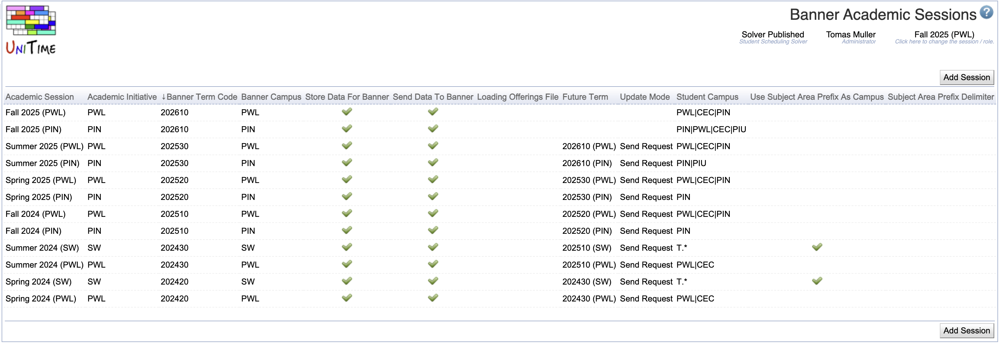

## Screen Description
The Banner Academic Sessions page allows defining Banner-related data for each academic session.

{:class='screenshot'}

Once a session is set to **store data for Banner**, whenever a change is made to a course, CRNs are automatically generated for all classes within the course.  If the courses are structured, the appropriate link identifiers are automatically created to tie the Banner sections together.  If a course is cross-listed, multiple banner sections are created for the course, and they are automatically tied together with appropriate cross-list identifiers.

## Details

For each UniTime session you wish to store data for Banner you will need to add a corresponding Banner session.

* **Academic Session**
	* The UniTime academic session

* **Banner Term Code**
	* The code used in Banner to identify a session, i.e. 201220

* **Banner Campus**
	* The string used to identify the campus in Banner

* **Store Data for Banner**
	* Whenever a change is made to a course in UniTime, store the appropriate data that is needed for Banner.

* **Send Data to Banner**
	* Whenever a change is made to a course in UniTime, send the appropriate data to Banner.
	* This is often turned off during session setup until Banner is ready to receive data for a session.

* **Future Term**
	* When a student update message is received, indicate the future Banner session that is also to be notified about the student change
	* It is possible to chain future terms, so for instance if a student is updated for Summer 2025, both Fall 2026 and Spring 2026 may get updated as well.

* **Update Mode**
	* When future term is selected, use one of the following:
	* **Disabled** no automatic future term updates
	* **Direct Update** student changes are automatically propagated into the future term
	* **Send Request** when student is changes, automatically request an update for the future term

* **Student Campus**
	* Empty when all students are to be accepted
	* Otherwise, a regular expression that the student campus code must match

* **Use Subject Area Prefix As Campus**
	* Check when one UniTime academic session is used for classes from multiple Banner campuses
	* The subject area is than prefixed with the campus code (e.g., PNW - ENGL)

* **Subject Area Prefix Delimiter**
	* When **Use Subject Area Prefix As Campus** is checked, indicate the delimiter between campus code and subject area code
	* Defaults to " - " when left empty

## Operations

Click a table header to sort the table by the given column. Second click on the same header will reverse the order.

### Add Banner Session

Click **Add Session** button to create a new record (for a new academic session).

{:class='screenshot'}

* Only existing academic session for which a Banner session does not exist are available in the **Academic Session** drop-down
* Only check the **Loading Offerings File** when recovering from a failed Banner Offerings XML load. Uncheck once the Banner offerings have been successfully imported.
* Click **Save** to create a new Banner session
* Click **Back** to go back to the list of Banner sessions without making any changes.

### Edit Banner Session
Click a line to edit information about the existing academic session.

{:class='screenshot'}

* Click **Update** to update the Banner session properties
* Click **Back** to go back to the list of Banner sessions without making any changes.
