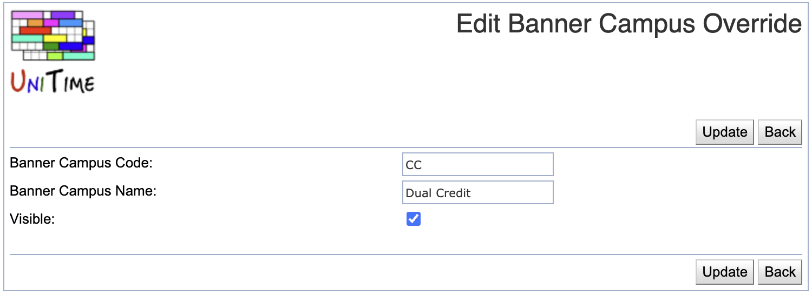

## Screen Description

This page allows configuring campus override options for the [Banner Offering Edit](banner-offering-edit) page.

{:class='screenshot'}

## Details

* **Banner Campus Code**
	* The code used in Banner to identify the campus

* **Banner Campus Name**
	* Name for the Banner campus override

* **Visible**
	* Banner campus overrides that are marked as NOT visible do not show in the drop-down of available campus overrides unless the section already has the override

## Operations

Click a table header to sort the table by the given column. Second click on the same header will reverse the order.

### Add Banner Campus Override

Click **Add Campus Override** to create a new campus override option

{:class='screenshot'}

* Click **Save** to create a new Banner campus override
* Click **Back** to go back to the list of campus overrides without making any changes

### Edit Banner Campus Override
Click a line to update an existing campus override or delete it

{:class='screenshot'}

* Click **Update** to update the campus override
* Click **Delete** to delete the campus override. Only overrides that are not being used can be deleted.
* Click **Back** to go back to the list of campus overrides without making any changes