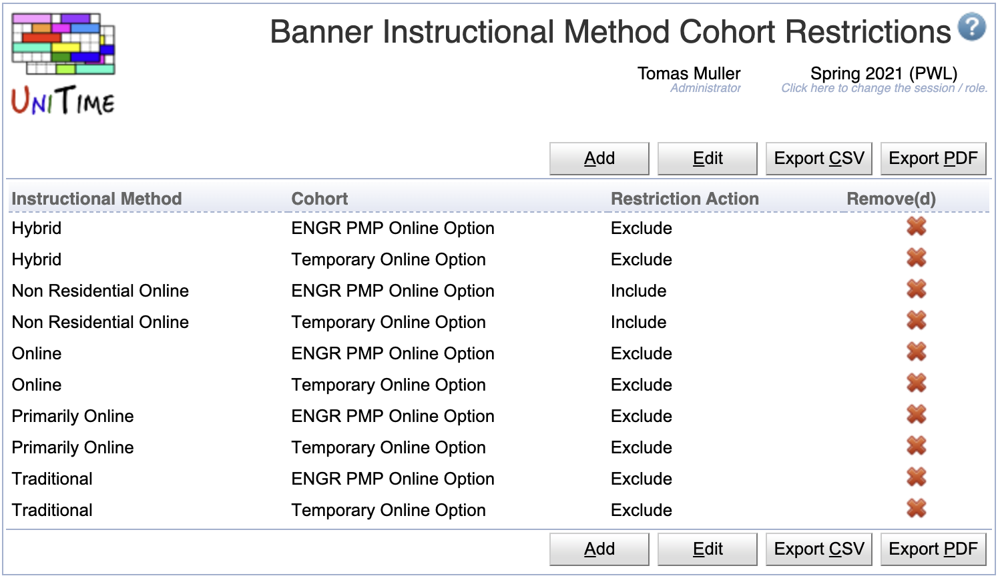

## Screen Description

This page allows to configure a set of rules (for the current academic session) that are used to automatically create or remove Banner COHORT restrictions based on the [instructional method](instructional-methods) of the class.

{:class='screenshot'}

**Note:** The Banner instructional method cohort restrictions are only needed when students can register directly in Banner. Otherwise, the cohort restrictions can be replaced by the [Student Scheduling Rules](student-scheduling-rules) which offer more options.

## Details

* **Instructional Method**
    * [Instructional method](instructional-methods) for which the rule applies

* **Cohort**
    * Student cohort ([student group](student-groups) of [group type](student-group-types) with reference COHORT)

* **Restriction Action**
    * Restriction is to either **exclude** or **include** students of the selected cohort

* **Remove(d)**
    * When checked, the rule is removed from the section (use for cleanup, if there is a rule change)

## Operations

The table can be sorted by any of its columns, just by clicking on the column header and the sorting option that opens.

### Add Banner Instructional Method Cohort Restriction
Click **Add** to add a new Banner instructional method cohort restriction

{:class='screenshot'}

* Click **Save** to create a new Banner instructional method cohort restriction
* Click **Back** to return to the list without making any changes

### Edit Banner Instructional Method Cohort Restriction
Click a particular Banner instructional method cohort restriction to make changes or to delete the Banner instructional method cohort restriction

{:class='screenshot'}

* Click **Save** to make changes, **Back** to return to the list without making any changes
* Click **Previous** or **Next** to save the changes and go to the previous or next Banner instructional method cohort restriction respectively
* Click **Delete** to delete the Banner instructional method cohort restriction.

### Edit Banner Instructional Method Cohort Restrictions
Click **Edit** to edit all Banner instructional method cohort restrictions

{:class='screenshot'}

* Use the  icon to add a new line and  to delete a line
* Click **Save** to make changes, **Back** to return to the list without making any changes

### Export CSV/PDF
Click the **Export CSV** or **Export PDF** to export the list of Banner instructional method cohort restrictions to a CSV or PDF document respectively