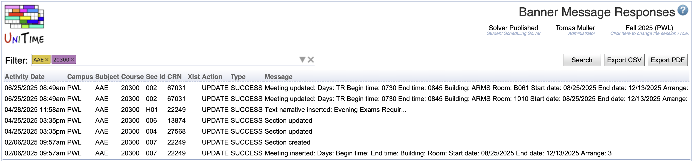

## Screen Description
The Banner Message Responses screen allows you to search for instructional offerings that contain errors when interfacing with Banner. These offerings were not pushed to Banner

{:class='screenshot'}

## Details

You may use the filter to search by subject area, course number, CRN, Action Type, Message, Cross-List ID, Start Date, Stop Date, Manager, or Department to retrieve up to 1,000 messages. The results may be exported in either in PDF or CSV formats. All errors must be corrected within UniTime or Banner and the offering must be pushed to Banner again.

In order to push these instructional changes to Banner, you must use the [Banner Offerings](banner-offerings) screen. Select the instructional offering you wish to resend. You will be redirected to the [Banner Offering Detail](banner-offering-detail) screen. From this screen, you will need to click the **Resend to Banner** button.
