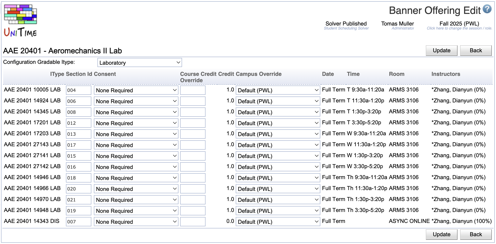

## Screen Description

The Banner Offering Edit screen allows users to change the consent on an individual section and change your section ids (system generated).

{:class='screenshot'}

## Details

Note: Make sure to use three characters for your section id.

If you wish to change the gradable subpart select the drop down box located next to Configuration Gradable Itype and choose the desired Itype.

Note: By changing the gradable subpart, the Banner form SSASECT will be updated to reflect the gradable subpart, populate the approved course credit hours/billing hours and check the appropriate Banner box labeled gradable. The non-gradable subpart will have zero credit/billing hours and will be flagged as non-gradable.
