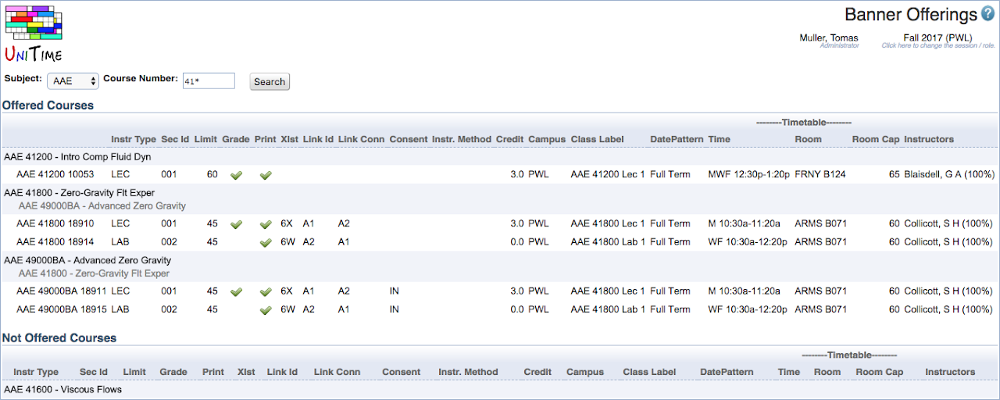

## Screen Description

The Banner Offerings page provides schedule managers with a list of the Banner Sections and the associated data that is sent to Banner.  If the user clicks on a Banner offering they are taken to a page that allows the schedule manager to make changes to the Banner Sections.

{:class='screenshot'}

## Details

The Banner Offering form provides the functionality to resend classes that did not import correctly, once corrected within the application.

It also provides the user the opportunity to modify section ids, change the gradable subpart and change consent at the section level.

Note: These types of changes do NOT require the user to click the resend button.

## Operations

To make a change:

* You can enter a particular subject and course, or just a particular subject. Hit **Search** button.

* Click on the blue row containing the subject and course number on which you wish to work.

* Click **Edit** button.
