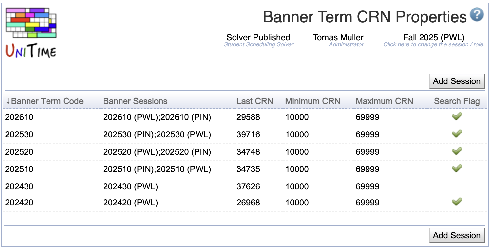
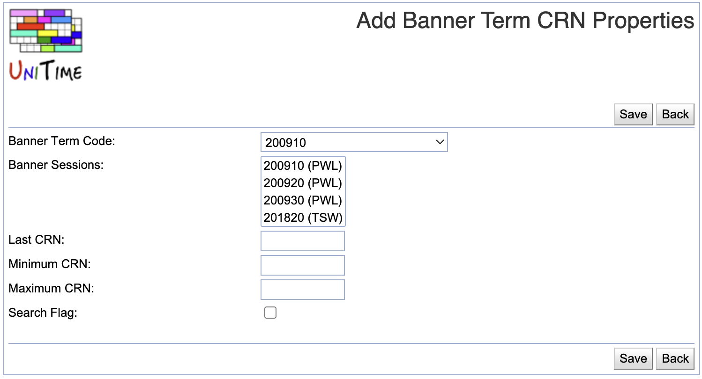
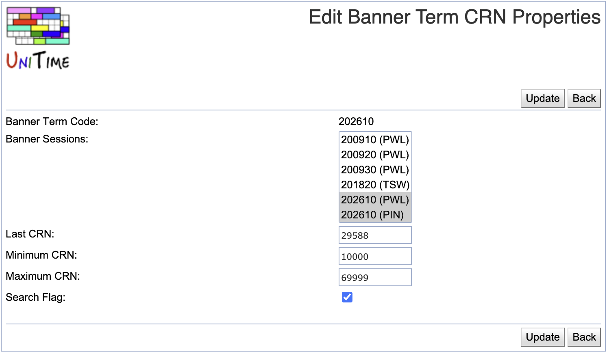

## Screen Description

This page allows configuring CRN properties for each Banner session.

{:class='screenshot'}

## Details

* **Banner Term Code**
	* The code used in Banner to identify a session, i.e. 201220.

* **Banner Sessions**
	* One or more Banner sessions (with the same term code) for which the parameters apply.

* **Last CRN**
	* The last CRN used on a Banner section.

* **Minimum CRN**
	* The lowest CRN available to UniTime to use on a Banner Section.

* **Maximum CRN**
	* The highest CRN available to UniTime to use on a Banner Section.

* **Search Flag**
	* Search through all CRNs used for the Banner session and pick one that is not in use.
	* This is used when the Maximum CRN is in use and the system needs to find unused CRNs.

## Operations

Click a table header to sort the table by the given column. Second click on the same header will reverse the order.

### Add Banner Term CRN Properties

Click **Add Session** to provide CRN properties for a new academic session.

{:class='screenshot'}

* Only existing Banner sessions for which no CRN properties exist are available in the **Banner Sessions** drop-down
* Click **Save** to create a new Banner Term CRN properties
* Click **Back** to go back to the list of Banner Term CRN Properties without making any changes.

### Edit Banner Term CRN Properties
Click a line to modify CRN properties for an existing Banner session.

{:class='screenshot'}

* Click **Update** to update the Banner Term CRN Properties for the selected Banner session(s)
* Click **Back** to go back to the list of Banner Term CRN Properties without making any changes