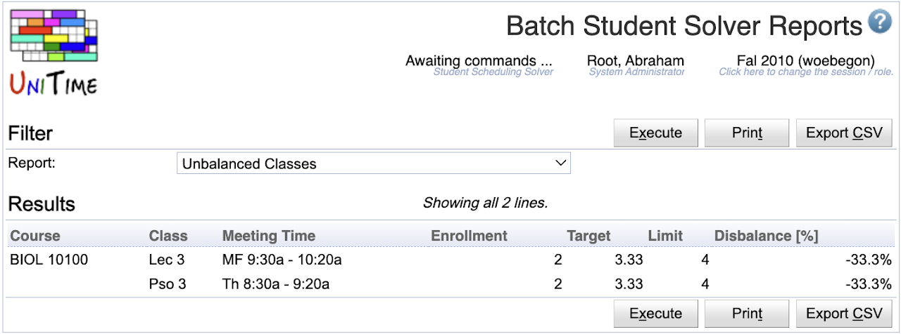

## Screen Description

The Batch Student Solver Reports page offers a list of standard reports computed directly from the student scheduling solver data.

{:class='screenshot'}

## Details

* **Report**
	* List of available reports

* **Results**
	* Computed report

## Operations

* **Execute**
	* Run the report, show the resultant data

* **Print**
	* Run the report, format the report in a more printer-friendly way, and open up the print dialog.

* **Export CSV**
	* Run and export the report in a CSV format.

