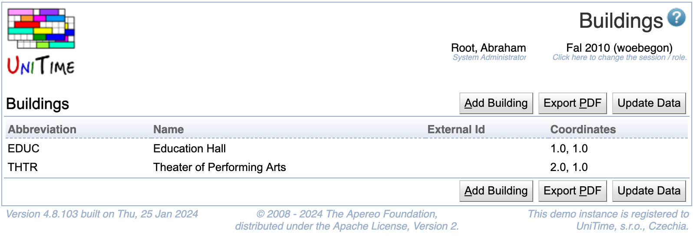

## Screen Description

 The Buildings screen contains a list of university buildings (that are included in the room inventory).

{:class='screenshot'}

## Details

* **Abbreviation**
	* Building abbreviation

* **Name**
	* Name of the building

* **External ID**
	* External ID of the building (optional)

* **Coordinates**
	* Coordinates of the building (used in calculating distances between buildings)
		* Distance between two buildings is computed as [Euclidean distance](http://en.wikipedia.org/wiki/Euclidean_distance) between coordinates × 10 meters (e.g., distance between coordinates [0,0] and [3,4] is 50 meters)
		* Coordinates cannot be negative
		* A building with no coordinates is assumed to be too far from any other building (for instructor and student back-to-back constraints)

 Click on any building in the list to edit its details.

 Note: If you do not have coordinate system established, entering the same coordinates (e.g., [0,0]) for all buildings will ensure that there will be no "too far" instructor and student back-to-back constraint violations in the problem.

## Operations

* **Add Building** (ALT+A)
	* Add a new building in the [Add Building](add-building) screen

* **Export PDF** (ALT+P)
	* Export the list of buildings into a PDF file

