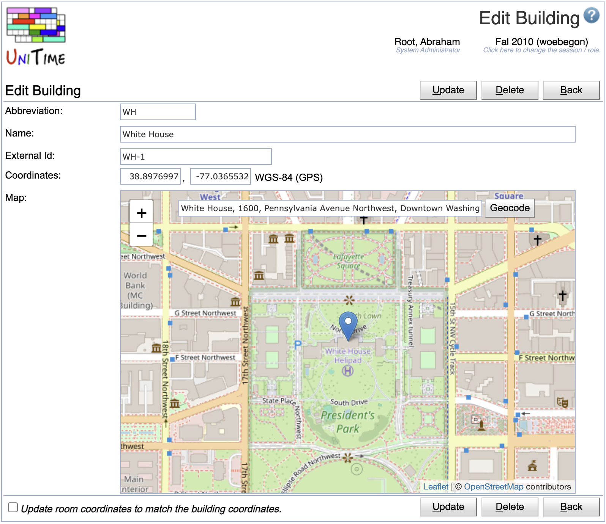

## Screen Description

The Buildings screen displays and allows editing of the list of available university buildings for the current academic session.

{:class='screenshot'}

## Properties

Each building contains the following properties:

* **Abbreviation**
	* Building abbreviation

* **Name**
	* Name of the building

* **External Id**
	* External ID of the building (optional)

* **Coordinates**
	* Coordinates of the building (used in calculating distances between buildings)
	* The [Online Demo](https://demo.unitime.org) is using Euclidean distances
		* Distance between two buildings is computed as [Euclidean distance](http://en.wikipedia.org/wiki/Euclidean_distance) between coordinates × 10 meters (e.g., distance between coordinates [0,0] and [3,4] is 50 meters)
		* Coordinates cannot be negative
		* This is the LEGACY option for the `unitime.distance.ellipsoid` property in the [Application Configuration](application-configuration)
	* By default the UniTime application is configured to use GPS coordinates ([WGS84](https://en.wikipedia.org/wiki/WGS84) ellipsoid)
		* This can be changed by setting the `unitime.distance.ellipsoid` property in the [Application Configuration](application-configuration)
	* A building with no coordinates is assumed to be too far from any other building (for instructor and student back-to-back constraints)

**Note:** If you do not have a coordinate system established or do not know/want to use GPS coordinates, entering the same coordinates (e.g., [0,0]) for all buildings will ensure that there will be no "too far" instructor and student back-to-back constraint violations in the problem.

## Operations

### Add Building
Click **Add Building** (ALT+A) a new building in the [Add Building](add-building) screen

{:class='screenshot'}

* Click **Save** to create a new building
* Click **Back** to return to the list without making any changes

### Edit Building
Click on any building in the list to edit its details or to delete a building.

{:class='screenshot'}

* Check the *Update room coordinates to match the building coordinates* toggle to update coordinates for all the rooms in the buidling.

* Click **Update** to make changes, **Back** to return to the list without making any changes
* Click **Delete** to delete a building. Buildings that are being used (there is a committed timetable using at least one room of the building) cannot be deleted.

**Tip:** If GPS coordinates are being used, the map automatically updates as the coordinates (longitude and latitude) are entered. It is also possible to type in an address in the map and click the **Geocode** button to find the location of the building and populate the coordinates. The map can also be used to adjust the coordinates by moving the blue marker.

### Export PDF
Click **Export PDF** to export the list of buildings into a PDF file

### Update Data
Use this to update buildings and rooms when they have been imported using the [XML Interface](xml) on the [Data Exchange](data-exchange) page.
The buildings and rooms XML import does not update the buildings and rooms directly, but the results are stored in external buildings and rooms tables.
To update the rooms, you need to click on the **Update Data** button on the [Buildings](buildings) page.

By default, only new rooms are created. There are additional properties (to be set on the [Application Configuration](application-configuration) page) that can change that, namely:
* `unitime.external.room.update.existing` ... also update existing rooms (when set to true, defaults to false)
* `unitime.external.room.update.existing.features` ... when updating existing rooms, also reset global room features
* `unitime.external.room.update.existing.departments` ... when updating existing rooms, also reset room departments

