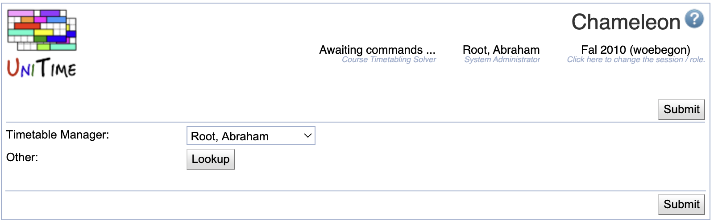

## Screen Description

The Chameleon screen enables the administrator to switch to any other user and have exactly the same access to data and solver as the user has (the administrator "becomes" the user and any changes, e.g., in filters or in the loaded timetable will be as if the user made them - so the administrator should be careful - a change, e.g., in a filter can be confusing for the user).

{:class='screenshot'}

**Hint:** You can easily access this page by clicking on your name at the top of the page [Current User](current-user).

## Details

Select the user's name in the **Timetable Manager** drop down list and click on the **Submit** button to switch to this user.

By default, only another Timetable Manager can be selected from the drop-down. When `unitime.chameleon.lookup` is set to `true` in the [Application Configuration](application-configuration), any user can be looked up using the **Lookup** button. When clicked, the [People Lookup](people-lookup) dialog can be used to look up another user.