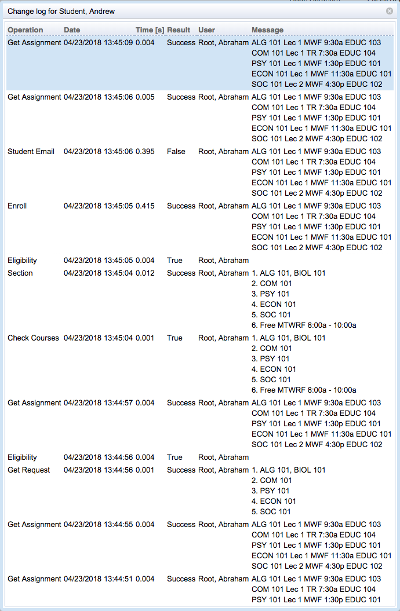

## Screen Description

The Change log for (student's name) pop-up window presents a history of changes performed during the student scheduling process. The table is the same as the Change Log table in the [Online Student Scheduling Dashboard](online-student-scheduling-dashboard) screen when the filter is set to "student: student's name" in that screen.

{:class='screenshot'}

## Details

See the description of the Change Log table in the help screen for the [Online Student Scheduling Dashboard](online-student-scheduling-dashboard) for more detail.

Click on any change in the list to get to its [Change message](change-message-for-student) screen.

## Operations

No clickable buttons are available.

