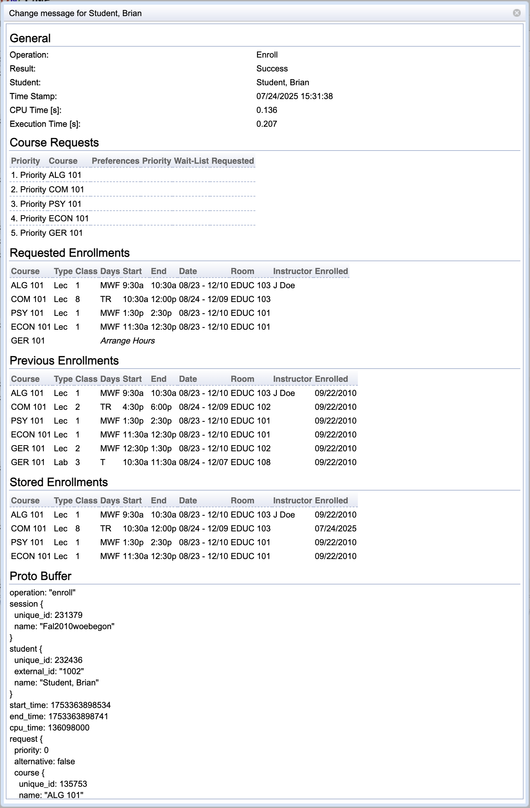

## Screen Description

The Change message for (student's name) screen provides history of changes in enrollments of a given student into particular class(es). Even changes that did not result in enrollments (such as looking for alternatives, rescheduling, etc.) are listed here for the purpose of understanding how the student has worked with the scheduling assistant.

{:class='screenshot'}

## Details

The screen is divided into several sections. The first and the last one are always the same, the middle sections depend on the operation of the change.

**General**

General properties of the change

* **Operation**
	* Operation performed during the change
	* The basic operations are
		* Approve Enrollments
			* Grant consent of instructor/department
		* Check Offering
			* Check instructional offering after someone freed a space in it or after a server has been restarted
		* Enroll
			* Enroll a student into a class
		* Expire Reservations
			* A change in the student's course, not necessarily influencing his/her enrollment
		* Mass Cancel
			* Mass cancellation of students' enrollments
			* Can be done e.g. when students have not paid their tuition
		* Reload Offering
			* Changes due to the fact that an offering has been changed (e.g., a class has been assigned a different time/room) - when the offering is reloaded, the change can result in cancelling/adding some enrollments (new enrollment = success, cancelled enrollment = failure)
		* Section
			* Section a student into classes after he/she has clicked on Schedule or Re-schedule in the [Student Scheduling Assistant](student-scheduling-assistant)
		* Student Email
			* Email sent to the student - details about the email are in the lower part of this screen
		* Suggestions
			* The student has entered the Alternatives screen to see suggested changes to his/her schedule

* **Result**
	* Result of the operation

* **Student**
	* Student who's enrollments have been subject to the change

* **Time Stamp**
	* Time when the operation was executed

* **CPU Time [s]**
	* Duration of the operation

**Courses**

A list of courses subject to the change.

**Stored Enrollments**

Usually enrollments stored in the database - a list of classes the student is enrolled to and their properties. For operation Enroll: The enrollments stored in the database at the end of the operation as the result of the enrollment.

**Approved Enrollments**

For operation Approve Enrollments: classes for which a consent has been granted during this change.

**Requested Enrollments**

For operation Enroll: The list of scheduled classes for which the student hits the Enroll button in the [Student Scheduling Assistant](student-scheduling-assistant) screen.

**Previous Enrollments**

Enrollments as stored in memory (not necessarily database) before the operation was executed.

**Computed Enrollments**

Enrollments as calculated by computer after Schedule or Re-schedule button had been clicked. For operation Suggestions: A section of Computed Enrollments is created for each alternative suggestion in the [Alternatives](alternatives-for-class) screen.

**Proto Buffer**

Very detailed information about the change in a computer-readable format.
