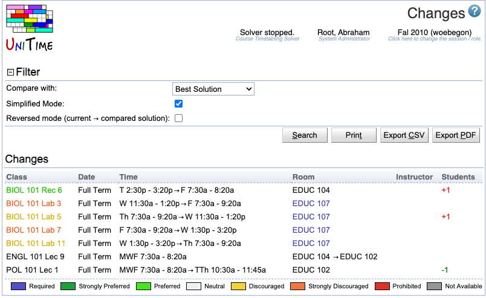

## Screen Description

In the Changes screen, you can see changes made to the timetable. You can compare the current timetable with the Initial, Best, or Selected timetable. To undo a change, click on it and click on the Assign button in the [Suggestions](suggestions) screen which will pop up.

{:class='screenshot'}

Hint: To compare two saved solutions, load one solution into the solver (using [Timetables](timetables) page) and then select the second one (also using [Timetables](timetables) page).

## Details

### Filter

Set up the filter to display changes you are interested in:

* **Compare with**
	* Select with which timetable you want the current timetable to be compared
	* Options:
		* Best Solution - best solution found so far (either generated by the solver or saved by the user to the best timetable found so far in the [Solver](solver) screen)
		* Initial Solution - timetable initially loaded into the solver (it needn't be the same as the selected solution, since some classes might have been assigned/unassigned due to a change in input data)
		* Selected Solution - timetable selected in the Timetables screen

* **Simplified mode**
	* In the simplified mode, only the number of additional student conflicts is displayed for each change
	* When unchecked, more criteria are listed for each change

* **Reverse mode (current → compared solution)**
	* When checked, time and room changes are listed in reversed order

### Changes

A list of changes in time/room assignments. Click on any change to go to the [Suggestions](suggestions) screen where there will be a suggestion reversing that change (an "undo" of the change).

## Operations

* **Apply**
	* Apply changes made to the filter

* **Export PDF**
	* Export the list of changes to a PDF document

* **Refresh**
	* Refresh the screen

