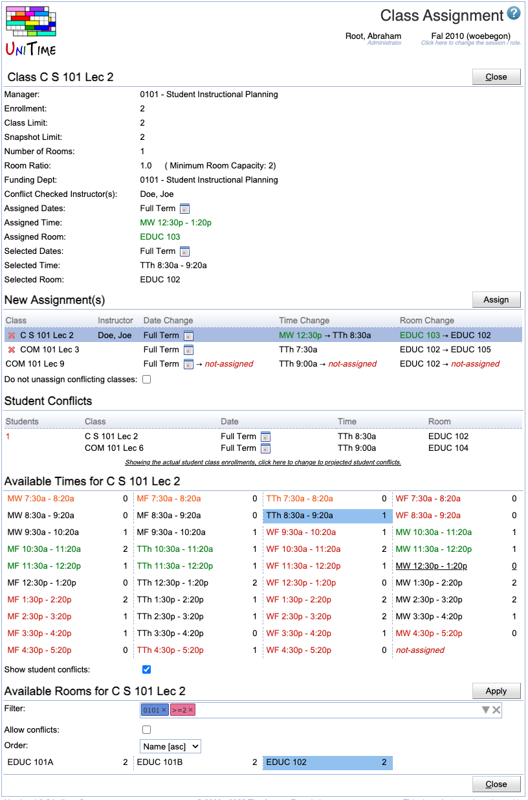

## Screen Description

The Class Assignment screen provides an interface for making changes to the current time and room assignment of a class. The changes can be made here when no timetable is loaded (as opposed to the screens in the Solver section) since this screen only works with available times/rooms and does not provide suggestions that would include suggested changes to the assignment of other classes. The screen is accessible from the [Class Detail](class-detail) screen in case the department for this class has a committed solution (and no other solution is selected or loaded into the solver).

{:class='screenshot'}

## Details

The first section of the screen provides an overview of the class-related information.

* **Manager**
    * Manager responsible for timetabling this class
    * Editable in the [Multiple Class Setup](multiple-class-setup) screen

* **Enrollment**
    * Number of expected students

* **Class Limit**
    * Number of students that should be able to register for a given class
    * Editable in the [Multiple Class Setup](multiple-class-setup) screen

* **Snapshot Limit**
    * The class limit at the time the [Limit and Projection Snapshot](limit-and-projection-snapshot) was taken.

* **Number Of Rooms**
    * Number of rooms needed for a class (usually one)
    * Editable in the [Multiple Class Setup](multiple-class-setup) screen

* **Room Ratio**
    * The ratio of the required room size to the class limit
        * Room Ratio = Room Size / Class Limit
    * In almost all cases, this should be one
    * Some exceptions to the norm
        * You need a room for fewer students than the class limit (Room Ratio is less than one)
        * You need a room for a class with zero limit. In this case, Room Ratio needs to contain the required room size
    * In parenthesis after the room ratio, you can see the minimum room capacity required for this class (for Class Limit <> 0, it is calculated as Room Size = Room Ratio * Class Limit; if Class Limit = 0, then Room Size = Room Ratio)
    * Editable in the [Multiple Class Setup](multiple-class-setup) screen

* **Attendance**
    * When there are two or more rooms required for the class
    * **Split Attendance** means that students are expected to split between the two (or more) rooms. That is the total capacity of the assigned room &times; the room ratio must be equal to or greater than the class limit.
    * **Alternative Attendance** means that all students are expected to be able to fit in any of the assigned rooms. That is, the room capacity of any assigned room &times; the room ratio must be equal to or greater than the class limit.
    * Editable in the [Multiple Class Setup](multiple-class-setup) screen

* **Funding Dept**
    * The department providing funding for this class.
    * This field is not visible by default.  To enable this field, the `unitime.courses.funding_departments_enabled` application property must be set to `true`.
    * Editable in the [Multiple Class Setup](multiple-class-setup) screen

* **Date Pattern**
    * Days/weeks throughout the semester during which this class will be taught
    * You can click on the icon of the calendar to see which dates belong to the selected date pattern
    * Editable in the [Edit Class](edit-class) screen

* **Conflict Checked Instructor(s)**
    * Names of instructors for whom conflicts should be avoided (such as teaching two classes in different rooms at the same time)

* **Assigned Dates**
    * Date pattern assigned in the current committed timetable

* **Assigned Time**
    * Time assigned in the current committed timetable

* **Assigned Room**
    * Room assigned in the current committed timetable

* **Selected Dates**
    * Date pattern selected in the Class Assignment screen

* **Selected Time**
    * Time selected in the Class Assignment screen

* **Selected Room**
    * Room selected in the Class Assignment screen

## New Assignment(s)

A list of draft assignments that have been made through this screen. The new assignments are not executed until the **Assign** button is clicked. To remove an assignment from the list of new assignments, click on the  icon at the beginning of the line.

* **Class**
    * Class for which the assignment is about to change
* **Instructor**
    * Instructor for the class
* **Date Change**
    * Self-explanatory
* **Time Change**
    * Self-explanatory
* **Room Change**
    * Self-explanatory

**Do not unassign conflicting classes**
* If checked, the conflicting classes stay in the times and rooms where they were, and all conflicts need to be resolved manually

When online student scheduling is enabled, a warning  icon next to the class name indicates that the class cannot be modified because the offering is locked. Click the icon to unlock the offering first.

## Student Conflicts

A list of student conflicts caused by new assignments.

* **Students**
    * Number of students for which a given conflict has occurred
* **Class**
    * Classes involved in a conflict
* **Date**
    * Date patterns of classes involved in a conflict (the time from "new assignments" is taken if applicable)
* **Time**
    * Times of classes involved in a conflict (the time from "new assignments" is taken if applicable)
* **Room**
    * Rooms of classes involved in a conflict (the room from "new assignments" is taken if applicable)

By default, when students are already enrolled, the table displays conflicts based on the current student class enrollments. Otherwise, it would show conflicts based on the student sectioning of the saved &amp; committed solution. The current display is indicated by the text at the bottom of the table; clicking the text will switch between the two options:
* *Showing the actual student class enrollments, click here to change to projected student conflicts.*
* *Showing projected student conflicts, click here to change to the actual class enrollments.*

## Available Dates

When the class is using a date pattern of the *Pattern Set* type (there is a choice of a date pattern, e.g., a week selection for a *1x* date pattern), one of the available date patterns can be selected in this table.

{:class='screenshot'}

## Available Times

A list of times available for the class that meet the restrictions on required time patterns. Time preferences are color-coded in the text color of the times. To select a new time assignment for a class, click on the time. Select *not-assigned*{:style='color:red;'} to unassign the class.

When **Show student conflicts** is checked, the number following the time indicates how many of the students currently enrolled in the class would have a time conflict if the class is placed at the given time.

## Available Rooms

A list of available rooms for the class. This section is displayed only when the time for a class has been selected.

* **Filter**
    * Only rooms meeting the [Room Filter](events-room-filter) are displayed
    * By default, the filter is prepopulated with the minimal room size (based on the class limit and the room ratio), and the managing department of the class
* **Allow conflicts**
    * Include rooms that are already being used
    * Such rooms are displayed in red and stroked through{:style='color:red;text-decoration:line-through;'}
    * The conflicting class is listed at the bottom of the mouse-over dialog
* **All rooms**
    * Allow also rooms from other departments (ignore room sharing)
* **Order**
    * Select the order of the rooms displayed in this section

Click **Apply** to apply changes to the list of rooms.

Click on a room from the list of available rooms to tentatively assign it to the class (and add the assignment to the New Assignment(s) section where it can be confirmed or removed).

When multiple rooms are required, click on all the rooms that are to be assigned to the class. The *(selected size: X of Y)* next to the section header indicates that the rooms selected so far have a total of X seats available while the minimum required room capacity is Y.

{:class='screenshot'}