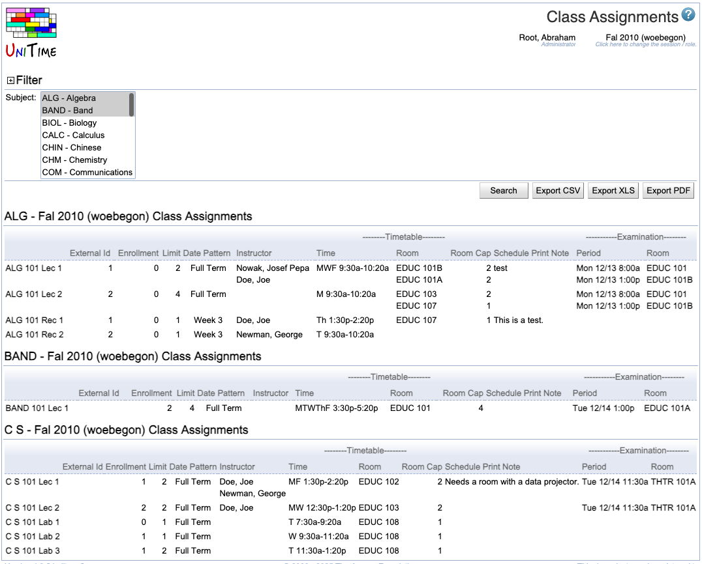

## Screen Description

The Class Assignments screen is the only place where you can see classes from other departments. For example, you can find times and rooms of large lecture room classes for Physics, computing labs for English, or departmental classes of Visual and Performing Arts. Filtered results of your search are sorted by the subject area and if you export the results into a PDF, each subject area will begin on a new page in the resulting document.

{:class='screenshot'}

## Details

### Filter

* **Manager**
	* Select a manager to display only classes that are being timetabled by that manager
		* For example, select "Large Lecture Room Manager" to see all the classes that require a large lecture room (for the subject area(s) you select in the Subject field)

* **Instructional Type**
	* Select whether you want to see all types of classes or only e.g. Lectures

* **Assigned Time**
	* Indicate whether you want to see only classes taught at a specific time and/or on specific days (if nothing is entered for Assigned Time, all times/days are considered - you do not need to check all days)
	* The assigned time is time assigned during timetabling

* **Assigned Room**
	* Filter by room assigned to a class during timetabling

* **Sort By**
	* Select how you want to sort the resulting list of classes
	* If you check "Sort classes only within scheduling subparts", the "Sort By" parameter will be applied only within each scheduling subpart - the classes will first be sorted by course number, then by scheduling subpart, and then by the criterion you selected

In the line below the filter part, select a subject area (or multiple subject areas by holding the Ctrl key and clicking on the subject areas you want to select) in the **Subject** field and click on the **Search** (Alt+S) button to apply the filter on the classes of selected subject area(s).

The **search results** will be displayed as a list of classes for each subject area that you selected. The columns in the list are

* **External Id**
	* External Id of the class

* **Date Pattern**
	* Indicates which weeks during the semester the class is taught

* **Timetable**
	* Applicable only if a timetable has been committed for a given class
	* There are three parts of the timetable: (assigned) Time, (assigned) Room, and Room Capacity of the assigned room (Room Cap)

* **Student Schedule Note**
	* The class note that will be displayed in the online Schedule of Classes and the student schedule

## Operations

* **Export PDF** (Alt+P)
	* Export the search results into a PDF document (read more about the export in the description of the [Instructional Offerings](instructional-offerings) screen)
	* In the resulting document, each subject area will start on a new page

* **Export CSV** (Alt+C)
	* Export the search results into a "comma separated value" (CSV) document that can easily be opened e.g. in Microsoft Excel

