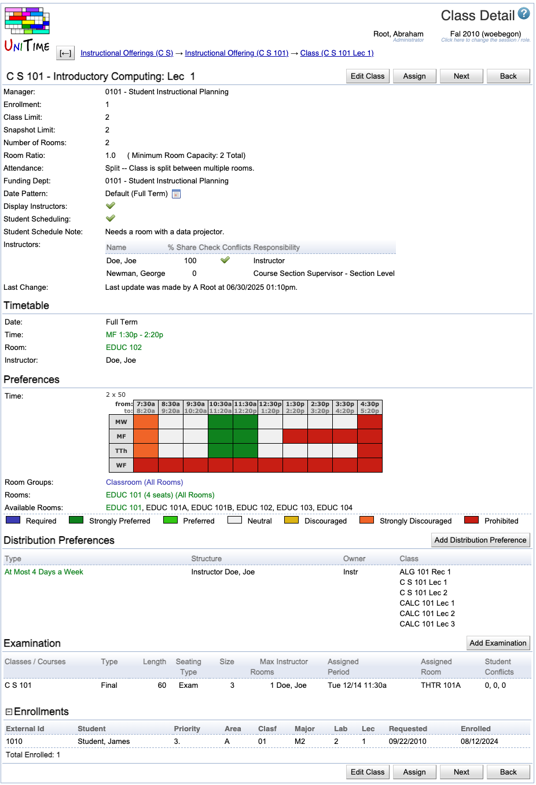

## Screen Description

The Class Detail screen offers an overview of information about a class. Most of the information is editable in the [Edit Class](edit-class) screen.

{:class='screenshot'}

## Details

The following fields are displayed in the upper part of the screen (below the name of the class):

* **Manager**
	* Manager responsible for timetabling this class
	* Editable in the [Multiple Class Setup](multiple-class-setup) screen

* **Enrollment**
	* Number of enrolled students (if available)

* **Class Limit**
	* Number of students that should be able to register for a given class
	* Editable in the [Multiple Class Setup](multiple-class-setup) screen

* **Number Of Rooms**
	* Number of rooms needed for the class (usually one)
	* Editable in the [Multiple Class Setup](multiple-class-setup) screen

* **Room Ratio**
	* The ratio of the required room size to the class limit
		* Room Ratio = Room Size / Class Limit
	* In almost all cases, this should be one
	* Some exceptions to the norm
		* You need a room for fewer students than the class limit (Room Ratio is less than one)
		* You need a room for a class with zero limit. In this case, Room Ratio needs to contain the required room size
	* In parenthesis after the room ratio, you can see the minimum room capacity required for this class (for Class Limit <> 0, it is calculated as Minimum Room Capacity = Room Ratio * Class Limit; if Class Limit = 0, then Minimum Room Capacity = Room Ratio)
	* Editable in the [Multiple Class Setup](multiple-class-setup) screen

* **Date Pattern**
	* Days/weeks throughout the semester during which this class will be taught
	* You can click on the icon of the calendar to see which dates belong to the selected date pattern
	* Editable in the [Edit Class](edit-class) screen

* **Display Instructors**
	* When checked (and it is checked by default), the instructors for this class will be displayed in the online Schedule of Classes
	* When not checked, the instructor will not be displayed in the online Schedule of Classes, and their name will have to be re-entered for reporting purposes
	* Editable in the [Edit Class](edit-class) screen

* **Student Scheduling**
	* When checked (and it is checked by default), the class will be avaliable to students during student scheduling
	* When not checked, the class will be treated as with zero limit during student scheduling (only students with individual reservations will be able to get in) - the class not to be displayed is in italics wherever it is listed
	* Editable in the [Edit Class](edit-class) screen

* **Student Schedule Note**
	* The class note that will be displayed in the online Schedule of Classes
	* Editable in the [Edit Class](edit-class) screen

* **Requests / Notes**
	* Requests/Notes for the manager who will timetable this class
	* Displayed only if it is not empty

* **Instructors**
	* The following information is displayed and can be edited in the [Edit Class](edit-class) screen
		* **Name**
			* Instructor's name
		* **Share**
			* The percentage of teaching activity for this class associated with this instructor
		* **Check Conflicts**
			* When checked, the instructor's preferences are considered during departmental timetabling; also, checks are performed for this instructor to make sure there is no conflict for them between this class and their other classes (such as teaching two classes at the same time)
			* When not checked, the instructor's assignment to this class is ignored during timetabling; no conflict checking will be performed between this class and their other classes

* **Last Change**
	* Information about the last change made to the class (recorded automatically when the [Edit Class](edit-class) screen is updated)

In the **Timetable** part, you see the time, room and instructor assigned to this class (once a timetable has been created)

* Normally, a committed timetable is displayed, unless there is a different timetable selected or loaded into the solver for the given class

* If there is a timetable loaded into the solver and a timetable selected, the loaded one is displayed

* See documentation for [Timetables](timetables) page for more detail.

In the **Preferences**, you will see any preferences that have been set up for this class (with color coding for preference levels).

* In **Available Rooms**, you will see only those rooms that meet your preferences and are large enough for your class (the room capacity is greater than or equal to the minimum room capacity displayed in the upper part of this screen)
	* Only the first few available rooms are displayed by default; if there are more rooms available than displayed, there are three dots at the end of the list - click on the three dots (...) to see the full list of available rooms

* To change the preferences, click on the Edit Class button to get to the [Edit Class](edit-class) screen. There is also more detailed documentation for the preferences in the help page for that screen.

## Operations

* **Edit Class** (Alt+E)
	* Go to the [Edit Class](edit-class) screen to edit properties and preferences for the class

* **Add Distribution Preference** (Alt+A)
	* Go to the [Distribution Preferences](distribution-preferences) screen to add a new distribution preference
		* The class will be pre-populated in that screen

* **Assign** (Alt+X)
	* Go to the [Class Assignment](class-assignment) screen to change the time/room assignment for this class 
	* Since this is a tool explicitly for making changes to the committed timetables, with less functionality than [Suggestions](suggestions) in the solver section, this button is displayed only when

* There is a committed timetable

* No timetable is loaded nor selected

* **Previous** (Alt+P)
	* Go to the Class Detail screen for the previous class

* **Next** (Alt+N)
	* Go to the Class Detail screen for the next class

* **Back** (Alt+B)
	* Go to the last non-editable screen through which you got here

