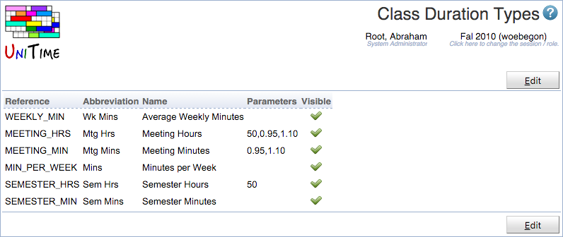
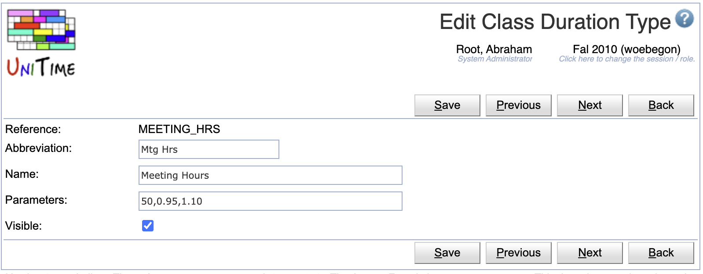
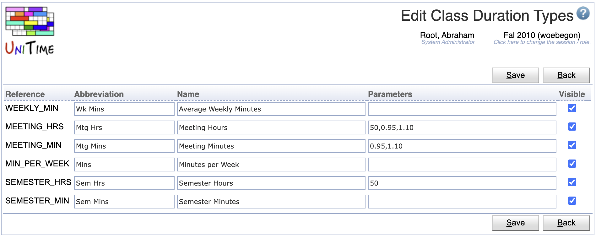

## Screen Description

The Class Duration Types page defines various class duration types.

{:class='screenshot'}

Permission Class Duration Types is needed to access the page, Class Duration Type Edit is needed to make changes.

The default duration type can be defined on an academic session and it can be overridden on the instructional offering configuration level (using the Instructional Offering Configuration page).

The name of the selected default duration type is used in the column headers (Classes, Instructional Offerings), duration type abbreviation is used to suffix durations that are using a non-default duration type.

It is possible to hide class duration types that are not to be used by the users. If only one type is visible, there is no selection of the class duration type on the Instructional Offering Configuration page.

The following class duration types have been implemented:

## Minutes per Week (default)

This is the existing behavior, where the minutes per week equals to the number of meetings times the minutes per meeting.

__Example:__ If a class has 90 minutes per week, a time pattern of 2 x 45 can be selected, regardless the selected date pattern. While this is how this has been always done in UniTime, the problem arises when one needs to combine different date patterns. For instance, a class that meets once every other week for 90 minutes still requires the class duration to be set to 90 minutes per week, which makes it harder to understand the meaning of the “minutes per week” concept as well as impossible to let the solver choose between 90 minutes every other week or 45 minutes every week.

## Average Weekly Minutes

The average number of minutes that a class takes during a week. The weekly minutes equals to the number of meetings times the number of minutes per meeting times the number of weeks of the data pattern and divided by the number of weeks in the term.

The average number of minutes class duration model has one parameter, the number of weeks in the term. It defaults to the number of weeks of the default date pattern.

__Example:__ A class of 90 average weekly minutes can either meet every other week for 180 minutes or weekly for 90 minutes, depending on the selection of the date and time pattern combination on the scheduling subpart and/or the class.

## Semester Minutes

The number of minutes in the semester. The number of semester minutes equals to the number of meetings times the number of minutes per meeting times the number of weeks of the data pattern.

__Example:__ A class meeting for 1260 semester minutes can meet for 90 minutes every week, if a date pattern with 14 weeks is selected; or for 180 minutes every other week, if a date pattern with 7 weeks is selected.

Please note that the number of weeks on a date pattern can be a fractional number. For instance, if a whole semester has 13 weeks, odd and even weeks date patterns can have 6.5 weeks despite the number of weeks (yellow boxes) actually selected on the date pattern.

## Semester Hours

The number of semester hours (the number of hours in the semester for the class to meet). The number of semester hours equals to the number of meetings times the number of minutes per meeting times the number of weeks of the data pattern and divided by the number of minutes in an hour.

The semester hours class duration model has one parameter, the number of minutes in an hour. It defaults to 50.

__Example:__ A class meeting for 14 semester hours can meet for an hour each week of for two hours every other week. If an hour has 50 minutes, one hour weekly time pattern is 1 x 50.

## Meeting Minutes

The number of minutes of all the class meetings, excluding vacations. The actually meetings of the appropriate class event are counted.

There are two parameters, defining the allowed variation of the meeting minutes, expressed as lower and upper bound. These parameters defaults to 0.95,1.10, which means a class can have 5% less time, while date and time pattern combinations which offer 10% more time can be also considered.

If the number of meetings based on the date pattern exceeds the desired number of meeting minutes, only meetings covering the given number of meeting minutes are created

__Example:__ A class meeting for 630 semester minutes needs to meet for 45 minutes each week in a semester with 14 weeks (using a date pattern with 14 weeks). Due to the bounds, it is possible to pick a day of week with only 13 meetings (13 > 14 × 0.95), but not a day with 12 meetings (12 < 14 × 0.95). A date pattern with 15 weeks can be selected (15 < 14 × 1.10), but in this case, there will be only 13 meetings created in the appropriate class event (it will only meet on the 13th week if there is a week with no meeting before).

## Meeting Hours

The number of hours of all the class meetings, excluding vacations. The actually meetings of the appropriate class event are counted.

There are three parameters, defining the allowed variation of the meeting minutes, expressed as lower and upper bound, and a number of minutes in an hour. These parameters defaults to 0.95,1.10,50 which means that a class can have 5% less time, while date and time pattern combinations which offer 10% more time can be also considered. There are also 50 minutes in an hour.

If the number of meetings based on the date pattern exceeds the desired number of meeting hours, only meetings covering the given number of meeting hours are created.

__Example:__ A class meeting for 28 semester hours needs to meet for 2 hours each week in a semester with 14 weeks (using a date pattern with 14 weeks). If the class meets once a week for 2 hours, due to the bounds, it is possible to pick a day of week with only 13 meetings (13 > 14 × 0.95), but not a day with 12 meetings (12 < 14 × 0.95). A date pattern with 15 weeks can be selected (15 < 14 × 1.10), but in this case, there will be only 13 meetings created in the appropriate class event (it will only meet on the 13th week if there is a week with no meeting before). Similarly, if a class meets twice for an hour each week, it needs to have at minimum of 26 meetings. So, for instance, if there are two public holidays on Monday, a 2 x 45 minutes class can use Monday (it would only miss 2 hours), while 1 x 90 can not (it would miss 4 hours).

## Operations

The table can be sorted by any of its columns, just by clicking on the column header and the sorting option that opens.

### Edit Class Duration Type

Click a particular class duration type to make changes to the class duration type

{:class='screenshot'}

* Click **Save** to make changes, **Back** to return to the list without making any changes
* Click **Previous** or **Next** to save the changes and go to the previous or next class duration type respectively

### Edit Class Duration Types
Click **Edit** to edit all class duration types

{:class='screenshot'}

* Click **Save** to make changes, **Back** to return to the list without making any changes

### Export CSV/PDF
Click the **Export CSV** or **Export PDF** to export the list to a CSV or PDF document respectively