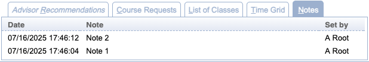

## Screen Description

The Classes for ... (student's name) screen provides an overview of classes of a given student. All requested courses are listed, even if the student is not enrolled in some of them.

{:class='screenshot'}

The Classes has multiple tabs and various buttons that may be displayed to a user depending on the permissions granted by their user role and the status of the student.

## Advisor Recommendations tab

{:class='screenshot'}

This tab lists the [advisor course recommendations](advisor-course-recommendations) when they have been filled in.

* **Priority**
	* Course request priority
	* Alternatives are listed as the following lines of the same priority.

* **Course**
	* Requested course or free time

* **Title**
	* Title of the requested course

* **Credit**
	* Credit information of the requested course

* **Critical**, **Important**, or **Vital**
	* Display course priority when enabled (courses of elevated priority take precedence before other courses in the solver)
	* See the `unitime.acrf.setCriticalCourses` configuration setting on the [Application Configuration](application-configuration) screen

* **No-Sub** or **Wait-List**
	* *No-Sub* indicates that a course cannot be replaced by a substitute course
	* *Wait-List* indicates that the course cannot be replaced by a substitute course and will be wait-listed when the student cannot get in during the batch
	* See the `unitime.acr.waitlist` configuration setting on the [Application Configuration](application-configuration) screen

* **Preferences**
	* Section and instructional method preferences

* **Notes**
	* Additional notes provided by the advisor

* **Changes**
	* Changes between the recommendations and student course requests

* **Advised**
	* Date and time when advised

* **Advisor**
	* Name of the advisor who filled in the recommendation

## Course Requests tab

{:class='screenshot'}

This tab lists the student’s course requests with alternates in priority order.

* **Priority**
	* Course request priority
	* Alternatives are listed as the following lines of the same priority.

* **Course**
	* Requested course or free time

* **Title**
	* Title of the requested course

* **Credit**
	* Credit information of the requested course

* **Preferences**
	* Section and instructional method preferences

* **Requested**
	* Timestamp of the course reques

## List of Classes tab
This tab displays the student’s course schedule in text format as the student would see it in the Scheduling Assistant.

{:class='screenshot'}

* **Subject**
	* Subject area of the course

* **Course**
	* Course number

* **Type**
	* Instructional type of a class

* **External Id**
	* External Id or section number of the class within the instructional type and the course

* **Avail**
	* Number of available seats in the class

* **Days**
	* Days on which the class will be taught

* **Start**
	* Start time for the class

* **End**
	* End time for the class

* **Date**
	* Dates during which the class will be taught

* **Room**
	* Assigned room

* **Instructor**
	* Instructor for the class

* **Requires**
	* Requirements for the class that need to be met
		* E.g., "Waiting for consent of instructor", or indication which lecture needs to be taken with a given recitation, etc

## Time Grid tab

This tab displays the student’s course schedule in time grid format as the student would see it in the Scheduling Assistant.

{:class='screenshot'}

## Wait-Listed Courses

This tab displays the student's wait-listed courses. It is only visible when the student is wait-listed in at least one course.

{:class='screenshot'}

* **Wait-Listed**
	* When the course was wait-listed.
* **Course**
	* Wait-listed course name
* **Title** 
	* Title of the wait-listed course
* **Credit**
	* Credit of the wait-listed course
* **Replaces**
	* When student requests a swap (within the course, or with some other course), this column shows what course is being replaced
* **Position**
	* Student's position on the wait-list
* **Requirements**
	* Student requirements, i.e., classes and/or instructional methods that the student requires, if any
* **Registration Errors**
	* Registration errors, if any, that are preventing the student from getting in

## Notes tab

This tab displays history of the notes set on the student (if there are any)

{:class='screenshot'}

## Operations

* **Advisor Recommendations**
	* Go to the [Advisor Course Recommendations](advisor-course-recommendations) screen to update course recommendations for the student

* **Course Requests**
	* Go to the [Student Course Requests](student-course-requests) screen to make changes to the course requests

* **Scheduling Assistant**
	* Go to the [Student Scheduling Assistant](student-scheduling-assistant) screen to make changes to the student-class enrollments

* **Send Email** (Batch Student Solver Dashboard)
	* Send an email to the student using the [Send email...](send-email) dialog

* **Change Log**
	* Go to the [Change log](change-log-for-student) screen for a given student
	* The pop-up screen will open only when there are any changes to be displayed
	* Available only when the screen is accessed from the [Online Student Scheduling Dashboard](online-student-scheduling-dashboard)

* **Close**
	* Close the dialog

