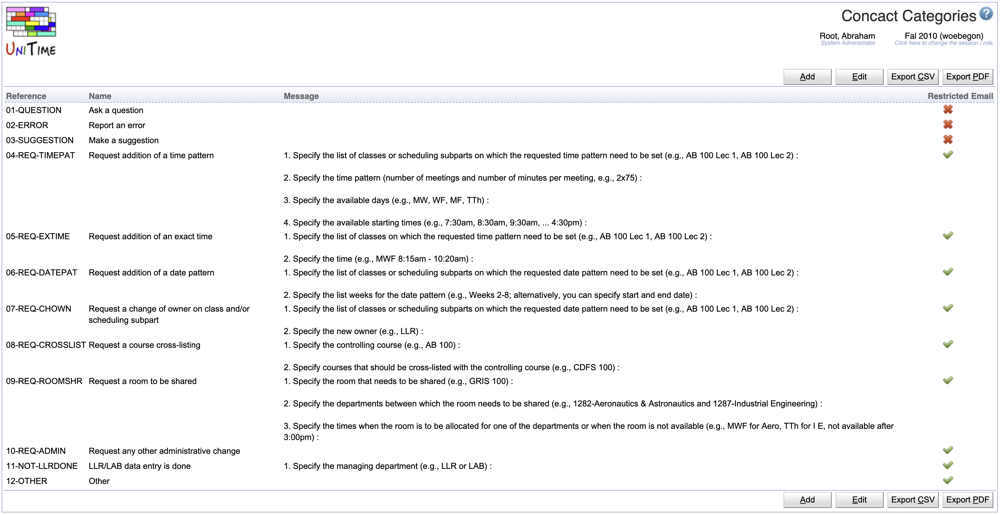
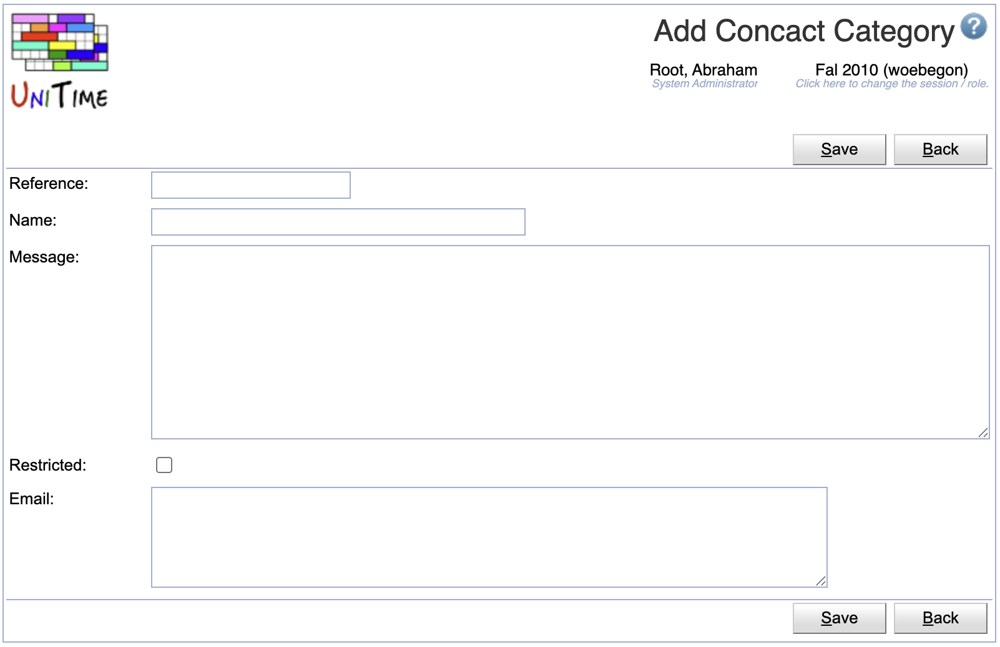
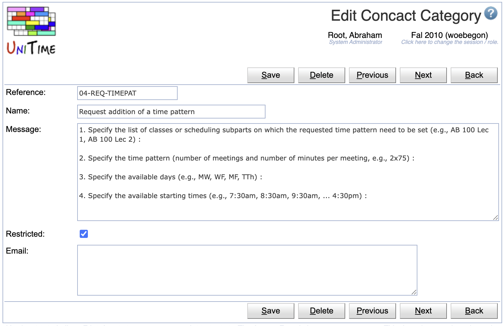
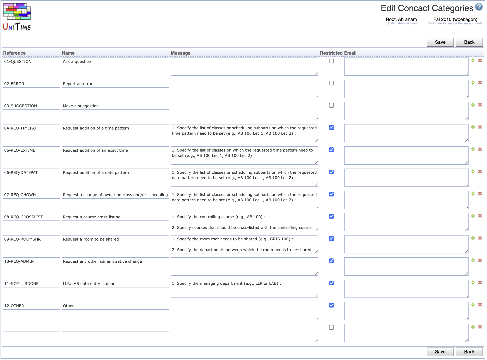

## Screen Description

The Contact Categories screen defines categories for the [Contact Us](contact-us) screen for the users to choose from.

{:class='screenshot'}

Each contact category contains:

* **Reference**
    * Unique reference
* **Name**
    * Name (listed in the **Category** drop-down on the [Contact Us](contact-us) screen
* **Message**
    * Default message that will pre-populate the **Message** field on the [Contact Us](contact-us) screen when the category is selected
* **Restricted**
    * When checked, only timetable managers can see/select this category
* **Email**
    * Email address where the contact us form will be sent
    * Can contain multiple email addresses, one per line
    * When left blank, the inquiry will be sen to the email address from the `unitime.email.inquiry` property configured in the [Application Configuration](application-configuration)

## Operations

The table can be sorted by any of its columns, just by clicking on the column header and the sorting option that opens.

### Add Contact Category
Click **Add** to add a new contact category

{:class='screenshot'}

* Click **Save** to create a new contact category
* Click **Back** to return to the list without making any changes

### Edit Contact Category
Click a particular contact category to make changes or to delete the contact category

{:class='screenshot'}

* Click **Save** to make changes, **Back** to return to the list without making any changes
* Click **Previous** or **Next** to save the changes and go to the previous or next contact category respectively
* Click **Delete** to delete the contact category.

### Edit Contact Categories
Click **Edit** to edit all contact categories

{:class='screenshot'}

* Use the  icon to add a new line and  to delete a line
* Click **Save** to make changes, **Back** to return to the list without making any changes

### Export CSV/PDF
Click the **Export CSV** or **Export PDF** to export the list of contact categories to a CSV or PDF document respectively