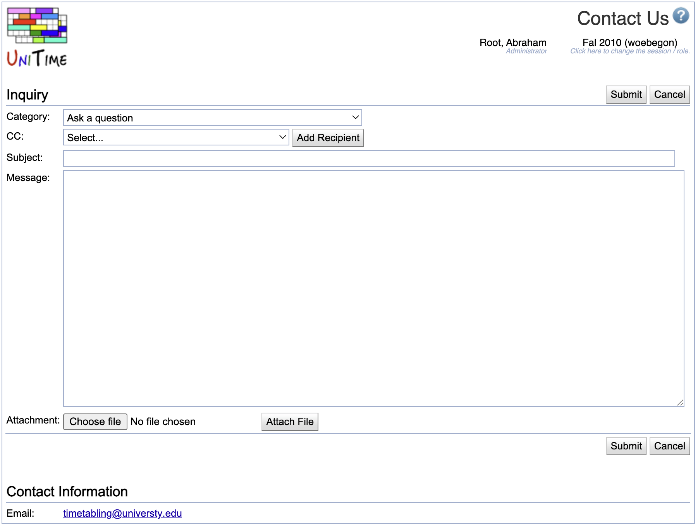

## Screen Description


 The Contact Us screen provides interface for the users to contact support people (either technical or timetabling support).

## Inquiry Details


 The various parts of an inquiry are

* **Category**
	* Category of an inquiry; based on this category, the Message part is pre-populated with text indicating which information is required to successfully respond to the inquiry

* **CC**
	* Select a manager from the list who should receive an email copy of your inquiry and click **Add Recipient** to add the person the list of recipients (you can add as many recipients as you need)
	* You can remove a person from the list of recipients by clicking on the red X icon

* **Subject**
	* Type in a meaningful subject for the inquiry

* **Message**
	* Body of the message sent to the support person(s) (pre-populated with some items for certain categories)


{:class='screenshot'}

## Contact Information


 Other means of contacts of the support team (may include office address, phone, email, and office hours). These can be defined in the application's custom properties file, properties ```tmtbl.contact.*```. See [Timetabling Installation](installation) for more details.
