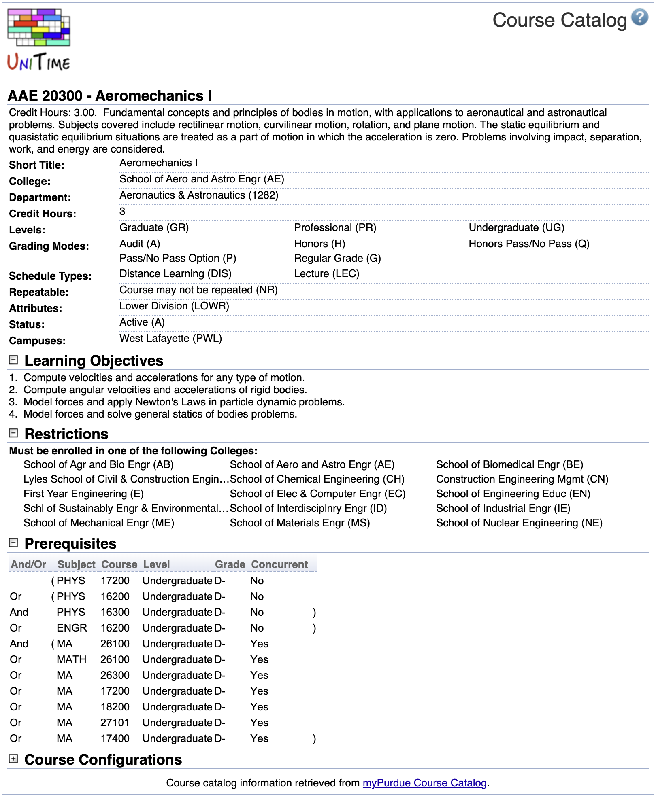

## Screen Description

The Course Catalog page can be used to display catalog information retrieved from an external system.

{:class='screenshot'}

To enable this page, you need to
1. set `unitime.custom.CourseUrlProvider` to `org.unitime.timetable.server.courses.CourseCatalogBackend` using the [Application Configuration](application-configuration) page
2. grant Course Catalog permission to the appropriate user roles (using the [Permissions](permissions) page)

Also, the course details provider needs to be configured, application property `unitime.custom.CourseDetailsProvider`.