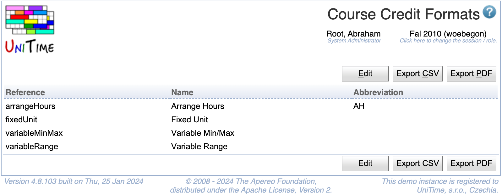

## Screen Description

 The Course Credit Formats page displays the existing credit formats. The four available formats are hard coded in UniTime, only their names and abbreviations are allowed to be changed.

{:class='screenshot'}

## Details

 There are four types of credit formats supported in UniTime. Arrange hours format does not have any number of units, fixed unit format has a fixed number of units, variable formats allow for a selection or a range for units. See [Course Credit](course-credit) description for more details.

## Operations

 A particular course credit format can be changed by clicking the appropriate line. All formats can be edited at once by clicking the **Edit** button.

Use the **Export** buttons to export this page's content.

