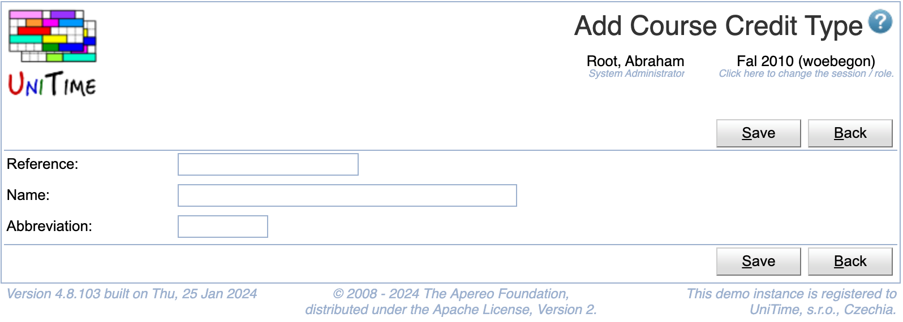
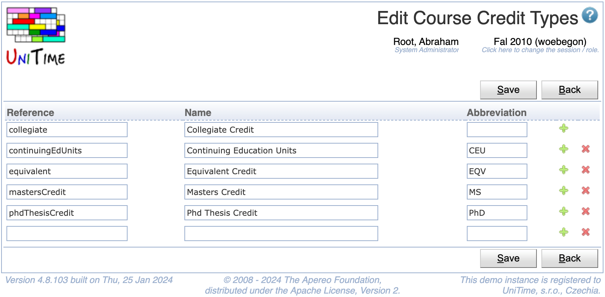

## Screen Description

The Course Credit Types page can be used to manage credit types. See [Course Credit](course-credit) description for more details.

{:class='screenshot'}

## Details

Each course credit type has a reference, a name, and an abbreviation. References and names must be unique. Only credit types that are not being used can be deleted.

## Operations

The table can be sorted by any of its columns, just by clicking on the column header and the sorting option that opens.

### Add Course Credit Type
Click **Add** to add a new course credit type

{:class='screenshot'}

* Click **Save** to create a new course credit type
* Click **Back** to return to the list without making any changes

### Edit Course Credit Type
Click a particular course credit type to make changes or to delete the course credit type

{:class='screenshot'}

* Click **Save** to make changes, **Back** to return to the list without making any changes
* Click **Previous** or **Next** to save the changes and go to the previous or next course credit type respectively
* Click **Delete** to delete the course credit type. Course credit types that are being used cannot be deleted.

### Edit Course Credit Types
Click **Edit** to edit all course credit types

{:class='screenshot'}

* Use the  icon to add a new line and  to delete a line
* Course credit types that are being used cannot be deleted
* Click **Save** to make changes, **Back** to return to the list without making any changes

### Export CSV/PDF
Click the **Export CSV** or **Export PDF** to export the list of course credit types to a CSV or PDF document respectively