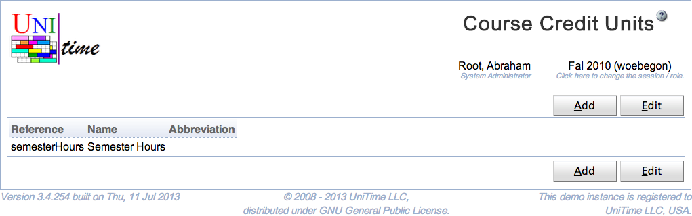

## Screen Description

 The Course Credit Units page can be used to manage credit units. See [Course Credit](course-credit) description for more details.

## Details

 Each course credit unit has a reference, a name, and an abbreviation. References and names must be unique. Only credit units that are not being used can be deleted.

## Operations

 To edit or delete a credit unit, click on the appropriate line, [Edit Course Credit Unit](edit-course-credit-unit) page will appear. All the credit units can be edited on the [Edit Course Credit Units](edit-course-credit-units) page. To do so, click on the **Edit** button.

 A new credit unit can be added on the [Edit Course Credit Units](edit-course-credit-units) page (button **Edit**) or using [Add](http://goog_1604282881) [Course Credit Unit](add-course-credit-unit) page (button **Add**).

 The table can be ordered by any of the columns. To do so, click on the column header and select Sort by <column name> option.

{:class='screenshot'}
