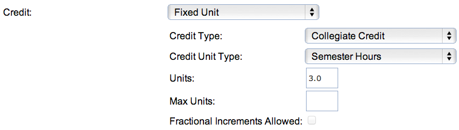
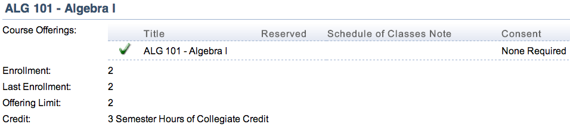
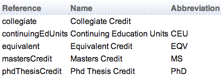

## Course Credit

Credit information in UniTime can be defined on an instructional offering (see [Course Offering Edit](edit-course-offering) page for the controlling course) or on each scheduling subpart (see [Edit Scheduling Subpart](edit-scheduling-subpart) page).

{:class='screenshot'}

Credit information is optional and it is only recorded in UniTime. It can be used in reporting. Most pages display the credit information in the abbreviated form with the name as a mouse over tooltip.

## Details

Credit information consists from a selection of credit format (e.g., variable credit or fixed units), credit type (e.g., collegiate or continuous education), credit unit type (typically semester hours) and a number of credits. Some credit formats do not have the number of units (arrange hours), some formats on the other hand have a range of units (e.g., variable credit). In case of a range, maximal number of units can be provided as well (the range is between the number of units and the max units number).

{:class='screenshot'}

Ability to define credit information on scheduling subparts is not enabled by default. To enabled it, set application property `tmtbl.subpart.credit.editable` to `true` (e.g., using [Application Configuration](application-configuration) page, see [UniTime Customization](installation#customization) for more details).

The number of units, credit format, type, and units are combined together in to one string. It can be also abbreviated using the abbreviations defined. For example:

* Variable range credit with continuing education units between 1 and 3 semester hours and fractional increments disabled translates to "1 to 3 Semester Hours of Continuing Education Units in whole number increments" and is abbreviated as "1-3 CEU"

* Variable min/max collegiate credit with 1 and 3 units translates to "1 or 3 Semester Hours of Collegiate Credit" and is abbreviated as "1,3"

* Fixed unit phd thesis credit with 2 semester hours units translates to "2 Semester Hours of Phd Thesis Credit" and is abbreviated as "2 PhD"

* Arrange hours equivalent credit translates to "Arrange Semester Hours of Equivalent Credit" and is abbreviated as "AH EQV"

## Credit Format

One of the following formats can be selected. Each format has a reference, a name and an abbreviation. Names and abbreviations can be changed using the [Course Credit Formats](course-credit-formats) page.

{:class='screenshot'}

* The **arrange hours** format does not have any units and the credit information. It is useful to provide an abbreviation since there is no number to display in the Credit column.

* The **fixed unit** format expects the number of units to be provided (max units field is disabled). It is usually abbreviated just as the entered number of units.

* The **variable min/max** format expects both number of units and max number of units to be entered. It is usually abbreviated as _min, max_ (where _min_ is the number of units, and _max_ is the max number of units). The meaning is that the credit given to student for the course is one of the two unit numbers.
	* The **variable range** format expects both number of units and max number of units to be entered. It is usually abbreviated as _min - max_ (where _min_ is the number of units, and _max_ is the max number of units). The meaning is that the credit given to student for the course is between the two unit numbers.

When variable range credit format is selected, fractional increments may be allowed (the Fractional Increments Allowed check box is enabled). If fractional increments are not allowed, the credit given to student must be a whole number.

## Credit Type

Various credit types can be defined on the [Course Credit Types](course-credit-types) page. Collegiate credit is usually the default one, and it does not have any abbreviation.

{:class='screenshot'}

## Credit Unit

Various credit units can be defined on the [Course Credit Units](course-credit-units) page. Usually there are only semester hours.

{:class='screenshot'}
