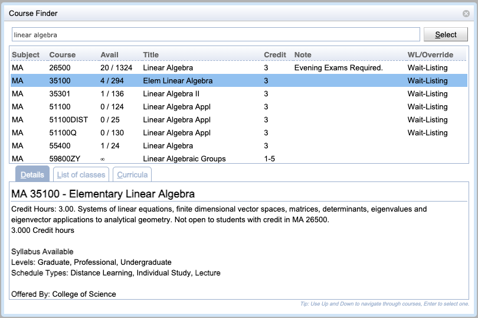

## Screen Description

 The Course Finder screen provides tools to look up a course or find information about a course. When the screen is opened from a line with a course, the course description appears, otherwise it is opened without any course information.

## Details

 **Filter**

 The top-most editable field is the filter field. As soon as the user starts entering letters or digits, a list of courses containing that character will appear in the table below. It is possible to filter by the course abbreviation, as well as the long name of the course.

 **Course table**

 The course table contains courses that fit the criteria entered in the filter field above. Click on any course to display details in the third part of the screen.

 Free Time tab is displayed in this section when the screen is used to pick courses/free time requests for the Student Scheduling Assistant. To select free times, the user needs to click on the fields with appropriate time slots and then press Enter to go back to the [Student Scheduling Assistant](student-scheduling-assistant) screen.

 **Course information**

 There are three types of information to be displayed about the course

* Details
	* Details about the course as listed in the course catalog

* Classes
	* A list of classes as defined in the Instructional Offerings section of the timetabling application

* Curricula
	* Curricula that contain the course, together with numbers of students for each academic classification

## Notes

 To close the Course Finder screen, press Esc or click on any place of the previous screen (outside the current screen). When you need to select a course or free time for the Student Scheduling Assistant screen, click on the course/free time and then press Enter.

{:class='screenshot'}
