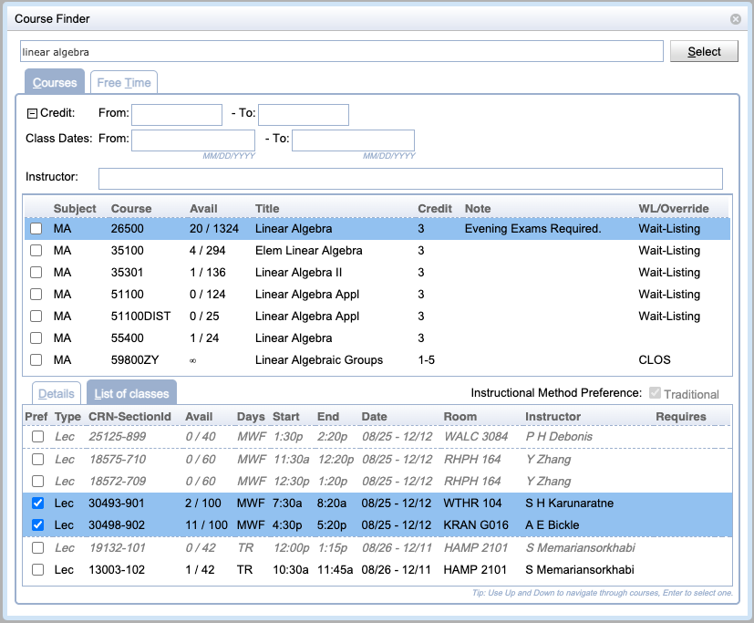
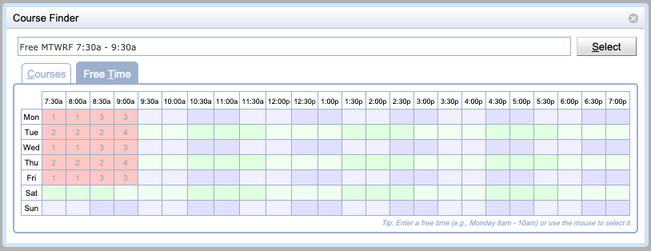

## Screen Description

The Course Finder screen provides tools to look up a course or find information about a course. When the screen is opened from a line with a course, the course description appears, otherwise it is opened without any course information.

{:class='screenshot'}
Course timetabling version of the Course Finder dialog (e.g., [Edit Curriculum](edit-curriculum) or [Add Reservation](add-reservation))

{:class='screenshot'}
Student scheduling version of the Course Finder dialog (e.g., [Student Course Requests](student-course-requests)).

## Details

**Filter**

The top-most editable field is the filter field. As soon as the user starts entering letters or digits, a list of courses containing that character will appear in the table below. It is possible to filter by the course abbreviation, as well as the long name of the course.

**Courses**

The course table contains courses that fit the criteria entered in the filter field above. Click on any course to display details in the third part of the screen.

* The student scheduling version also allows the list of courses to be filtered further by the credits, class dates, or instructor.
* When applicable, multiple courses can be selected using the checkboxes on the left side of the table. The selected courses will be used to populate the course and its alternatives in this case in the order the courses have been selected.

**Free Time** (student scheduling when used in the **Course Requests** table)

Free Time tab is displayed in this section when the screen is used to pick courses/free time requests for the [Student Scheduling Assistant](student-scheduling-assistant). To select free times, the user needs to click on the fields with appropriate time slots and then press Enter to go back to the [Student Scheduling Assistant](student-scheduling-assistant) screen.

{:class='screenshot'}

**Course information**

There are three types of information to be displayed about the course

* **Details**
	* Details about the course as listed in the course catalog

* **List of Classes**
	* A list of classes as defined in the Instructional Offerings section of the timetabling application
	* When the *Course Finder* dialog is used on any of the student scheduling pages, such as [Student Course Requests](student-course-requests), the *Classes* tab can be used to prefer (or possibly require) selected instructional methods or classes. Instructional Methods can be only selected when the course has two or more configurations with different instructional methods, such as Face-to-Face or Online.

* **Curricula**
	* Curricula that contain the course, together with numbers of students for each academic classification
	* Not available when the *Course Finder* dialog is shown on any of the student scheduling pages, such as [Student Course Requests](student-course-requests)

## Notes

To close the Course Finder screen, press Esc or click on any place of the previous screen (outside the current screen). When you need to select a course or free time for the Student Scheduling Assistant screen, click on the course/free time and then press Enter.

The custom [CourseDetailProvider](https://github.com/UniTime/unitime/blob/master/JavaSource/org/unitime/timetable/onlinesectioning/custom/CourseDetailsProvider.java) interface can be used to provide university-specific information on the Details tab, returning an HTML text to be displayed in the tab. The [DefaultCourseDetailsProvider](https://github.com/UniTime/unitime/blob/master/JavaSource/org/unitime/timetable/onlinesectioning/custom/DefaultCourseDetailsProvider.java) can be configured through the [Application Configuration](application-configuration) page to download and display a particular page from the course catalog (see the `unitime.custom.default.*` parameters).

