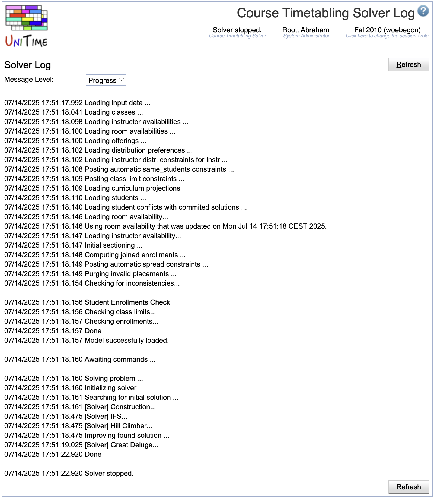

## Screen Description

The Solver Log screen can help an advanced user find what has been happening with the solver. The warnings and/or errors in the log are also displayed in the [Timetables](timetables) screen and in the [Solver](solver) screen.

{:class='screenshot'}

**Hint:** See [Solver Warnings](solver-warnings) to see a detailed list of warnings and errors that may be produced by the solver. If you see a FATAL message, keep the solver in the memory and use [Contact Us](contact-us) (located in Help menu) page to report a problem.

## Details

The amount of information displayed depends on the **Debug Level** chosen from the drop-down list:

* Trace - Most detailed log information

* Debug - Detailed log information

* Progress - All of the below plus details about solver stages (such as "improving found solution" during the "Solving" stage)

* Info - All of the bellow plus information about loading that does not constitute warnings

* Stage - All of the bellow plus names of the stages the solver goes through

* Warn - Display warnings and errors

* Error - Display errors only

* Fatal - Display fatal errors only

## Operations

* **Refresh**
	* Change the debug level to the level chosen from the drop-down list, and refresh the log
