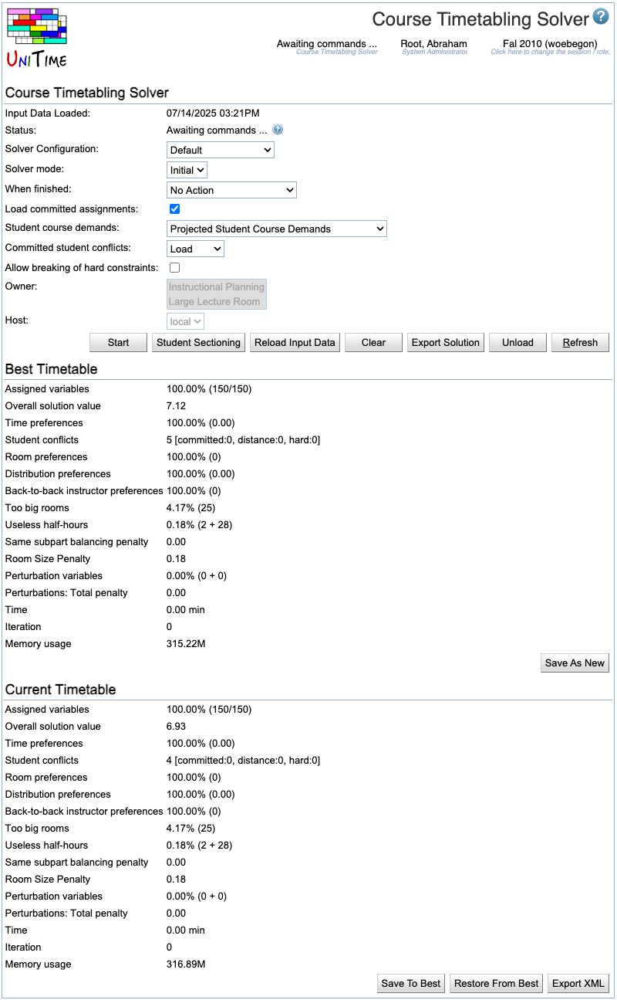

## Screen description

In the Solver screen, you can load input data to the solver and run the solver in different configurations and modes. The operations available to you and the amount and kind of information displayed will depend on the status of the solver (the first item of the Solver section).

{:class='screenshot'}

## Solver not started

### Solver

* **Status**
	* Current status of the solver

* **Solver configuration**
	* Configuration - see [Solver Configurations](solver-configurations) for more information

* **Solver mode**
	* Options: Initial - creates a new timetable; MPP - continues working on the loaded timetable, trying to find a better timetable with as few differences from the loaded one as possible

* **When finished**
	* Choose what to do when the time-out limit on the solver is reached

* **Allow breaking of hard constraints**
	* Allow breaking of required/prohibited times/rooms. This is useful to be able to assign a prohibited time or room to a class using the [Suggestions](suggestions) page while making interactive changes.

* **Student course demands**
	* Student course demands that are used during the timetabling to avoid student conflicts
		* Last Like Student Course Demands
			* Real student course enrollments from the last-like semester
			* Source of demands: [XML import](https://www.unitime.org/interface/studentCrsDemandImport.xml)
		* Weighted Last Like Student Course Demands
			* Real enrollments weighted so that the courses are filled with students
				* Example: When there were 15 students in a course last year and this year the course has a limit of 20, the last-like students in that course are multiplied by 20/15 
			* Source of demands: [XML import](https://www.unitime.org/interface/studentCrsDemandImport.xml) and class limits
		* Projected Student Course Demands
			* Projected demands calculated from the last-like student course demands using the projection rules from the [Curriculum Projection Rules](curriculum-projection-rules) screen
			* Source of demands: [XML import](https://www.unitime.org/interface/studentCrsDemandImport.xml) and [Projection Rules](curriculum-projection-rules)
				* Unlike with Last Like Student Course Demands and Weighted Last Like Student Course Demands, in this case it is important to import students and their properties (academic areas, majors, and classifications), this [XML import](https://www.unitime.org/interface/studentInfoImport.xml) prior to importing last like student course demands.
		* Curricula Course Demands
			* Course demands calculated from curricula
			* Source of demands: [Curricula](curricula) and/or [XML import](https://www.unitime.org/interface/curricula.xml)
		* Curricula Last Like Course Demands
			* A combination of curricula and (projected) last-like student course demands - the curricula help with course demands for new courses (and mandatory courses etc.) while the last-like information provides data about courses across curricula that the students took together
				* Use case: curricula only contain information about mandatory and elective courses, demands for optional courses are taken from last-like enrollment data. Last like data are also used to better estimate joint demands between courses.
			* Source of demands: [XML import](https://www.unitime.org/interface/studentCrsDemandImport.xml) and [Curricula](curricula)
		* Student Course Requests
			* Real requests as entered by students
			* Source of demands: either requests entered by students through the [Student Scheduling Assistant](student-scheduling-assistant) (Student Course Requests) or an [XML import](https://www.unitime.org/interface/woebegonStudents.xml)
		* Enrolled Student Course Demands
			* Real enrollments of students for this semester that is being timetabled (used mainly for testing)
			* Source of demands: [XML import](https://www.unitime.org/interface/studentEnrollmentImport.xml)

* **Student final sectioning**
	* Solver will perform student sectioning as a final stage of solving the problem (i.e., when a complete solution is found for Check configuration or upon time-out for the other configurations) to have more accurate information about student conflicts

* **Owner**
	* The solver group for which you want to create a timetable

* **Host** (admin)
	* Select server you want to run the solver on (setting "auto" means that the least occupied solver will be used, this is the default behavior for non-administrator users)

### Operations

* **Load**
	* Load all input data necessary to create a timetable (instructional offerings, rooms, instructors, distribution preferences, last like semester student enrollments, ...) to the solver. If one or more timetables have been selected on the [Timetables](timetables) page, their assignments will be loaded into the solver as well.

* **Start**
	* Load all necessary data and start creating a timetable

* **Refresh**
	* Refresh this screen

## Loading input data

During the loading phase, input data and student information is loaded and the classes which have only one required room and one required time will get them assigned.

### Solver

* **Input data loaded**
	* Time stamp from the time when the latest load of input data started

For the rest, see above

### Current Timetable

An initial timetable is created as soon as you start loading data. Only classes with one required time and one required room get there assignments at this point.

See [Solution Properties](solution-properties) for the description of the items in this part of the screen.

### Operations

* **Refresh**
	* Refresh this screen
		* When loading is done, new buttons will appear

## Awaiting commands

### Operations

* **Start**
	* Start the solver which will create/improve a timetable

* **Student Sectioning**
	* Run student sectioning (this will try to change assignments of students between alternative classes of a course in order to minimize student conflicts)

* **Reload Input Data**
	* Reload input data while keeping the current timetable
		* The assignments that are no longer valid due to the change in the input data will be unassigned (see the [Not-Assigned Classes](not-assigned-classes) screen for their list)

* **Unload**
	* Unload all data and the timetable from the solver

* **Export Solution**
	* Export the solution in the CSV (comma separated values) format

* **Refresh**
	* Refresh this screen

## Solving problem

### Solver

See above

### Operations

* **Stop**
	* Stop the solver

* **Refresh**
	* Refresh this screen

## Solver stopped

### Best Timetable Found So Far

During the automated timetabling (when the solver is running), the best timetable found so far is saved here. It is the timetable that is presented to the user when he/she stops the solver or when the time-out is reached.

When the user interacts and makes changes, he/she can save intermediate results as "Best Timetable Found So Far" and later come back to this timetable if the current one is not good.

Operations are self-descriptive

* **Save**
	* Replace the timetable that was loaded originally with this new one
		* Displayed only if a saved timetable was loaded

* **Save As New**
	* Save as a new timetable (do not replace the loaded one)

* **Save & Commit**
	* Replace the loaded timetable with a new one and commit it

* **Save As New & Commit**
	* Save as a new timetable and commit it

### Current Timetable

When solver is stopped, the Best Timetable Found So Far is the same as the Current Timetable. From that moment, any manual changes made by the user are applied to the Current Timetable.

Operations

* **Restore From Best**
	* Discard the current timetable and start again from the best timetable found so far

* **Save To Best**
	* Overwrite the Best Timetable Found So Far with this current timetable (when you consider the current one better and want to store it temporarily)

### Problems

The list of warnings appears if any problem occurred during the data load. If there is a problem during solving, there will be an error message (such as Error: FATAL).

**Hint:** See [Solver Warnings](solver-warnings) to see a detailed list of warnings and errors that may be produced by the solver. If you see a FATAL message, keep the solver in the memory and use [Contact Us](contact-us) (located in Help menu) page to report a problem.

### Operations

* **Start**
	* Restart the solver from the current timetable

* **Student Sectioning**
	* Perform student sectioning on the current timetable

* **Reload Input Data**
	* Reload the data from the Input Data section without loosing the current time/room assignments in the current timetable; only prohibited assignments will be lost if breaking hard constraints is not allowed

* **Unload**
	* Unload both the input data and the timetable from memory (any timetable will be lost unless saved in the Best Timetable Found So Far section or in the Timetables screen)

* **Export Solution**
	* Export the current solution as a comma separated values (CSV) file

* **Refresh**
	* Refresh this screen

