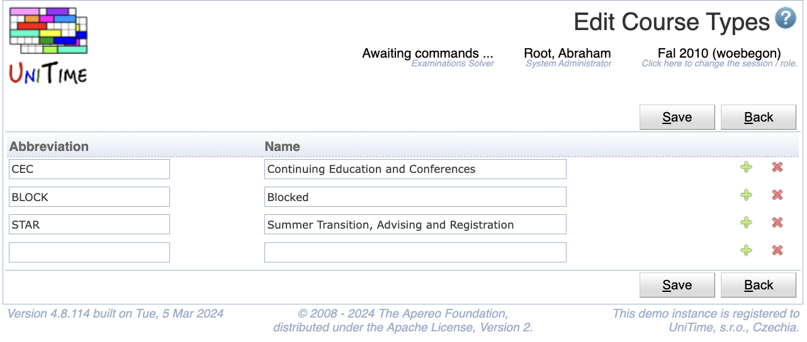

## Screen Description

The Course Types page allows to define types of courses and categorize courses based on these types. Each course offering can have no or one type associated with it. This allows for instance to distinguish between graduate and undergraduate courses, to separate continuing education courses, etc.

{:class='screenshot'}

The course types are independent from academic sessions. The relation between course offerings and course types are rolled forward together with the courses. The page can be accessed with Course Types permission, modifications can be made with Course Type Edit permission.

## Details

For student scheduling, it is possible to define in the student sectioning status what course types a student is allowed to take. Courses of a wrong type are not visible for the student in the [Student Scheduling Assistant](student-scheduling-assistant), unless the student is already requesting a particular course. While a student cannot request courses they are not allowed to (by the course type), a student advisor (a user with Student Scheduling Advisor permission) can request any course for the student on their behalf.

When there are some course types defined, Type drop down will appear on the [Edit Course Offering](edit-course-offering) page.

{:class='screenshot'}

## Operations

The table can be sorted by any of its columns, just by clicking on the column header and the sorting option that opens.

### Add Course Type
Click **Add** to add a new course type

{:class='screenshot'}

A course type has an abbreviation and a name defined. Both abbreviations and names have to be unique.

* Click **Save** to create a new course type
* Click **Back** to return to the list without making any changes

### Edit Course Type
Click a particular course type to make changes or to delete the course type

{:class='screenshot'}

* Click **Save** to make changes, **Back** to return to the list without making any changes
* Click **Previous** or **Next** to save the changes and go to the previous or next course type respectively
* Click **Delete** to delete the course type. Only course types that are not being used (there is no course of that type) can be deleted.

### Edit Course Types
Click **Edit** to edit all course types

{:class='screenshot'}

* Use the  icon to add a new line and  to delete a line
* Only course types that are not being used (there is no course of that type) can be deleted
* Click **Save** to make changes, **Back** to return to the list without making any changes

### Export CSV/PDF
Click the **Export CSV** or **Export PDF** to export the list of course types to a CSV or PDF document respectively
