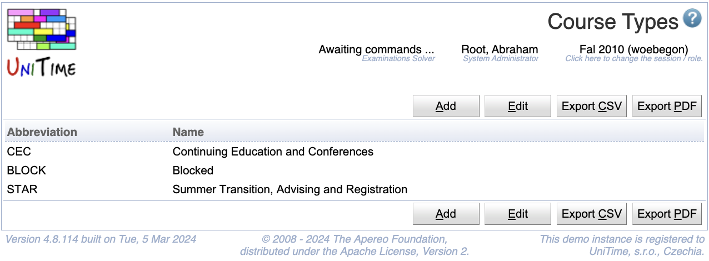
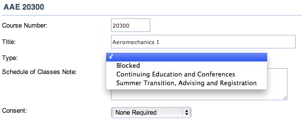

## Screen Description

 The Course Types page allows to define types of courses and categorize courses based on these types. Each course offering can have no or one type associated with it. This allows for instance to distinguish between graduate and under graduate courses, to separate continuing education courses, etc.

 The course types are independent from academic sessions. The relation between course offerings and course types are rolled forward together with the courses. The page can be accessed with Course Types permission, modifications can be made with Course Type Edit permission.

## Details

 For student scheduling, it is possible to define in the student sectioning status what course types a student is allowed to take. Courses of a wrong type are not visible for the student in the [Student Scheduling Assistant](student-scheduling-assistant), unless the student is already requesting a particular course. While a student cannot request courses he/she is not allowed to (by the course type), a student advisor (a user with Student Scheduling Advisor permission) can request any course for the student in his/her behalf.

 When there are some course types defined, Type drop down will appear on the [Edit Course Offering](edit-course-offering) page.

{:class='screenshot'}

{:class='screenshot'}

## Operations

 To edit or delete a course type, click on the appropriate line, [Edit Course Type](edit-course-type) page will appear. All the course types can be edited on the [Edit Course Types](edit-course-types) page. To do so, click on the **Edit** button. Only course types that are not being used can be deleted.

 A new course type can be added on the [Edit Course Types](edit-course-types) page (button **Edit**) or using [Add Course Type](add-course-type) page (button **Add**).

 The table can be ordered by any of the columns. To do so, click on the column header and select Sort by <column name> option.
