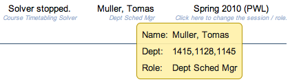

## Screen Description

 The Current User section can be found below the left hand side menu (in the lower left hand side corner). It provides basic data about the user currently logged on and the current academic session.

## Details

* **Name**
	* Name of the user
	* If you are logged on as administrator, you can click on the name to get to the [Chameleon](chameleon) screen and switch to another user

* **Dept**
	* Department managed by the user

* **Role**
	* Role of the user

* **Session**
	* The academic session currently being edited
	* Click on the session to go to the [Select Academic Session](select-academic-session) (or [Select User Role](select-user-role), if applicable) screen and change the academic session/user role

* **Status**
	* Status of the academic session

* **Database**
	* Database with the timetabling data that is being used

* **Version**
	* Version of the application

* **Logged**
	* Date and time of last login

{:class='screenshot'}
