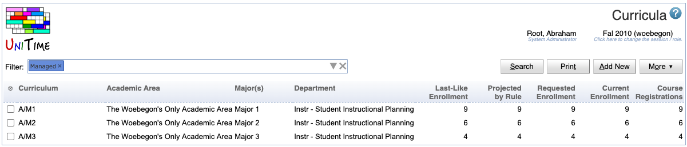

## Screen Description

The Curricula screen provides an overview of all curricula for a given semester. Click on any curriculum to go to the [Curriculum Detail](curriculum-detail) screen.

{:class='screenshot'}

## Details

### Filter

* Enter search criteria in the editable field and click on **Search** (Alt+S) to search for corresponding curricula 
* When the filter field is left empty and Search is clicked, all curricula for the given semester will be displayed
* When the mouse is placed over the filter field and is not moved for several seconds, a help text appears with suggested ways of entering search parameters

### Curricula table

The table displays a list of curricula meeting the search parameters entered in the filter field. The column headers are clickable and provide further options for working with the table:

*  Crossed ring (also available under the **More** button)
	* The crossed ring ⨂ is a header for checkboxes, displayed only for administrators
	* The corresponding menu has options as follows
		* Select All
			* Select all curricula in the table
		* Clear All
			* Unselect all selected curricula
		* Edit Requested Enrollments
			* Go to the [Curriculum Requested Enrollments](curriculum-requested-enrollments) screen to edit the requested enrollments of the selected curricula
		* Delete Selected Curricula
		* Merge Selected Curricula
			* Create one curriculum from all the selected curricula
		* Curriculum Projection Rules
			* Open the [Curriculum Projection Rules](curriculum-projection-rules) screen in a new window
		* Update Requested Enrollment by Projection Rules
			* For each curriculum, reset the Requested Enrollment values to values displayed in the Projected by Rule line in the [Curriculum Detail](curriculum-detail) screen
		* Update Requested Enrollment And Course Projections
			* Reset the Requested Enrollments values to values displayed in the Projected by Rule line in the [Curriculum Detail](curriculum-detail) screen and reset the course projections in the course table in the [Curriculum Detail](curriculum-detail) screen to values calculated from the Curriculum Projection Rules table
			* Used e.g. to reset the numbers of students without deleting the whole curricula
		* Populate Course Projected Demands
			* Populate the Course Projected Demands as displayed in the [Instructional Offering Detail](instructional-offering-detail) screen, do not include students of major(s) whose curricula do not include the course
		* Populate Course Projected Demands (Include Other Students)
			* Populate the Course Projected Demands as displayed in the [Instructional Offering Detail](instructional-offering-detail) screen, include also students of major(s) whose curricula do not include the course
		* Recreate Curricula from Last-Like Enrollments & Projections
			* Create a curriculum for each major from the [Curriculum Projection Rules](curriculum-projection-rules) table, set the requested enrollments and course projections to values derived from that table

* Curriculum
	* The corresponding menu has options as follows
		* Show Names
			* Show names of curricula instead of abbreviations
			* Displayed only when the table shows abbreviations
		* Show Abbreviations
			* Show abbreviations instead of names
			* Displayed only when the table shows names
		* Sort by Curricula
			* Sort alphabetically by curriculum name or abbreviation (whichever is displayed)

* Academic Area
	*  The corresponding menu has options as follows
		* Show Abbreviations
			* Show academic area abbreviations instead of names
			* Displayed only when the table shows names
		* Show Names
			* Show names of academic areas instead of their abbreviations
			* Displayed only when the table shows abbreviations
		* Sort by Academic Area
			* Sort alphabetically by academic area name or abbreviation (whichever is displayed)

* Major(s) 
	* The corresponding menu has options as follows
		* Show Codes
			* Show codes of the majors instead of names
			* Displayed only when the table shows names
		* Show Names
			* Show names of the majors instead of their codes
			* Displayed only when the table shows codes
		* Sort by Major(s) 
			* Sort the table alphabetically by major name or code (whichever is displayed)

* Department
	* The department responsible for the curriculum (the manager of this department controls the curriculum in the timetabling application)
	* The corresponding menu has options as follows (note: from the display options, the option that is currently used is not visible in the menu)
		* Show Code
		* Show Abbreviation
		* Show Name
		* Show Code - Name
		* Show Abbv - Name
		* Sort by Department
			* Sort by department, by the text that is currently displayed in the table (department name or abbreviation or ...)

* Last-Like Enrollment
	* Number of students of a curriculum's major(s) enrolled in the courses of this curriculum in the last-like semester
	* The menu has only the option to Sort by Last-Like Enrollment
		* Sort the table by this column increasingly

* Projection by Rule
	* Projected numbers of students
	* The corresponding menu has options as follows
		* Curriculum Projection Rules
			* Open the [Curriculum Projection Rules](curriculum-projection-rules) page in a new window
			* Displayed only for administrators
		* Sort by Projection by Rule
			* Sort the table by this column increasingly

* Requested Enrollment
	* Number of expected students as entered by the curriculum managers
	* The menu has only the option to Sort by Requested Enrollment
		* Sort the table by this column increasingly 

* Current Enrollment
	* Number of students of a curriculum's major(s) currently enrolled in the curriculum's courses
	* The menu has only the option to Sort by Current Enrollment
		* Sort the table by this column increasingly

* Course Registrations
	* Number of students that are currently requesting the course (using student course requests, e.g., via the [Student Course Requests](student-course-requests) page)
	* The menu has only the option to Sort by Course Registrations
		* Sort the table by this column increasingly

When the mouse rolls over a line, the Curriculum Classification table from the [Curriculum Detail](curriculum-detail) screen is displayed in a text field for that curriculum.

Click on any curriculum in the list to go to the [Curriculum Detail](curriculum-detail) screen for that curriculum.

## Operations

* **Search** (Alt+S)
	* Search all curricula for curricula meeting the Filter parameters (roll the mouse over the text field for entering parameters to find out more about possible parameters and their formats)

* **Print** (Alt+P)
	* Print the curricula table as displayed in the current screen

* **Add New** (Alt+A)
	* Go to the [Add Curriculum](add-curriculum) screen to add a new curriculum

* **More ↓** (Alt+M) 
	* More options for actions/operations in this screen
	* The options are described above, as they are the same as for the "Crossed ring" table header
