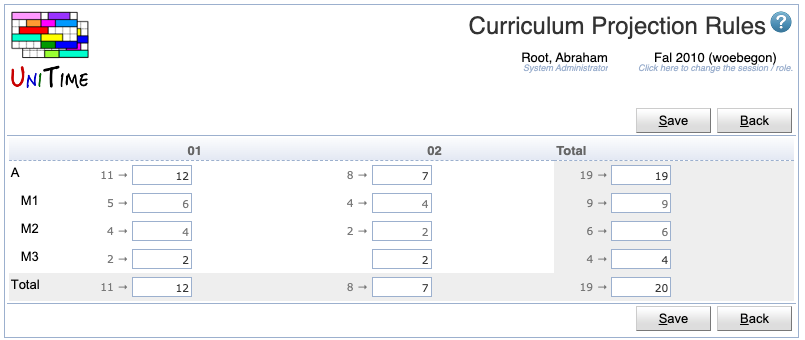

## Screen Description

The Curriculum Projection Rules displays numbers of students that are expected for given major(s) and academic areas, derived from projections based on last-like student data and other estimates. The table is editable by administrators.

{:class='screenshot'}

## Details

This section describes the editable version of the table, after the Edit button has been clicked. However, the content of the table is the same in both cases.

### Table

* The table displays the projected demands per Academic Area and Major(s) for each academic classification (the academic areas and majors are on the left, academic classifications on top)
	* Note: Click "Expand All" in the menu that opens when clicking on the table header to see the major(s); otherwise by default just the academic areas are displayed
* The numbers for an academic area serve as default values for the majors - when a number is changed in the line of an academic area, it is projected to those of the majors that still keep their default values
* The default projected demands for a major can be overwritten on the line with this major.
* The **Total** line at the bottom of the table is calculated from the numbers on the lines with majors, not academic areas
* When the mouse is rolled over a field, a text is displayed that shows which Academic Area, Major, and Academic Classification intersect on that field

* When the user clicks anywhere in the header line of the table, a menu with the following options appears
	* Show Numbers
		* Show numbers of projected students instead of percentages
		* Displayed only when the table shows percentages
	* Show Percentages
		* Show percentages of projected students instead of numbers (the projected enrollment is percentage of the last-like enrollment)
		* Displayed only when the table shows numbers
	* Show Last-Like Enrollments
		* Show last-like enrollments (in front of the projected enrollment numbers if numbers are displayed and the numbers have changed from the last-like semester; behind the projected enrollments numbers if percentages are displayed)
	* Expand All
		* Expand all academic areas to display their majors
	* Collapse All
		* Collapse all majors, display only the academic area

* The user can click on any academic area to display/hide its majors

## Operations

* **Edit** (Alt+E)
	* Edit the projected demands

* **Save** (Alt+S)
	* Save the changes made to the projected demands

* **Print** (Alt+P)
	* Print the table as displayed in the screen

