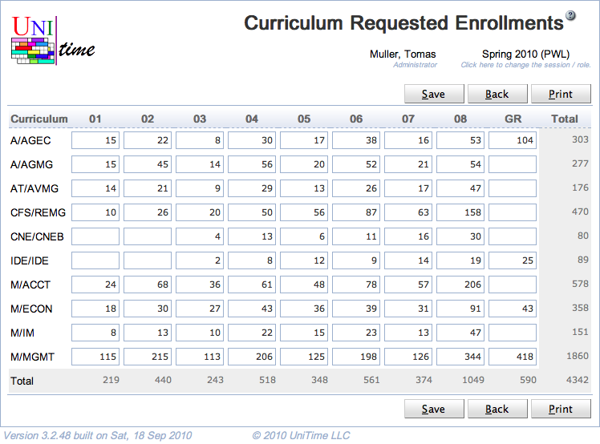

## Screen Description

 The Curriculum Requested Enrollments screen provides interface for entering requested enrollments for two or more curricula at the same time.

 The screen is accessible e.g. from the Curricula screen - select two or more curricula and click on the option "Edit Requested Enrollment" in the menu that opens upon clicking on "More ∨" or the crossed ring column header.

## Details

 **Table**

* For each curriculum, its line is equivalent to the Requested Enrollments line in the [Edit Curriculum](edit-curriculum) screen (except for the Total column)
	* Curriculum
		* Curriculum abbreviation
		* When the table header is clicked, a menu appears with options as follows
			* Show/Hide Projection by Rule
				* Show/hide estimated numbers of students derived from projections for majors
			* Show/Hide Current Enrollment
				* Show/hide the number of students of this curriculum who are enrolled in the course
			* Show/Hide Last-Like Enrollment
				* Show/hide numbers of students from above majors who took the course during the last-like semester
			* Show All Classifications
				* Show all classifications, including the empty ones
			* Hide Empty Classifications
				* Show only classifications that have positive requested or last-like enrollment
			* Sort by Curriculum
				* Sort by the curriculum abbreviation
	* Academic Classification
		* For each academic classification, it is possible to enter requested enrollment for a given curriculum
		* The menu that opens when the header is clicked is the same as for the Curriculum header, except that the last option is to sort by that academic classification
	* Total
		* Total requested enrollments per classification

* When the mouse is placed over a field in the table, a text appears displaying Curriculum, Academic Area, Major(s), and Academic Classification for which the requested enrollments should be entered in that field

## Operations

* **Save** (Alt+S)
	* Save the requested enrollments and go back to the [Curricula](curricula) screen

* **Back** (Alt+B)
	* Go back to the [Curricula](curricula) screen without saving any changes

* **Print** (Alt+P)
	* Print the screen as currently displayed

{:class='screenshot'}
