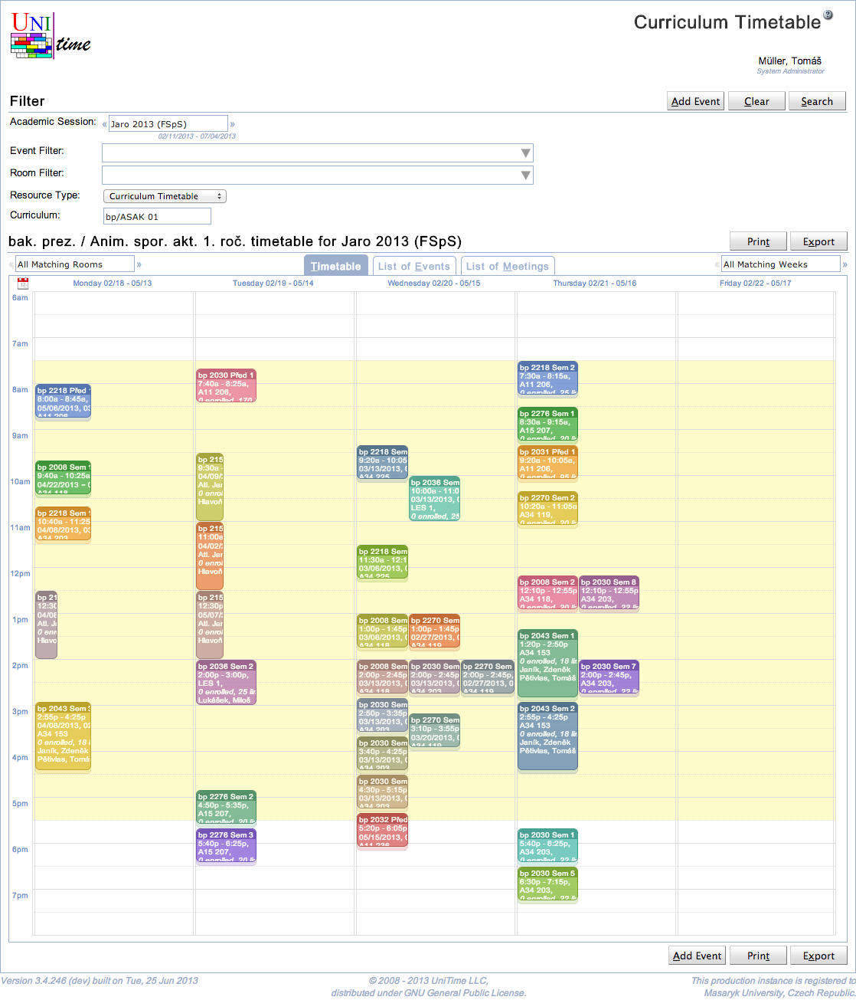

## Screen Description

Curriculum Timetable page is a variant of the [Events](events) page that allows to see a timetable of a particular curriculum or one of its classifications.

{:class='screenshot'}

When the Resource Type is changed to Curriculum Timetable, one can see all class, examination, and course related events that are related to a particular curriculum. Either events for all classifications (years of study) or just one classifications can be displayed. This list can be filtered further using the [Event Filter](events-event-filter) and [Room Filter](events-room-filter).

{:class='screenshot'}

Please note that if a curriculum contains a course, all classes of the course will be displayed unless there is a matching curriculum reservation on the course.

Besides of the ability to filter events and rooms (see description of the [Event Filter](events-event-filter) and [Room Filter](events-room-filter)), the page allows to select a particular **resource type**. The following options can be selected:

* [Room Timetable](room-timetable) (all events of a particular room)

* [Subject Timetable](subject-timetable) (all class, examination, and course related events of a subject area or a course offering)

* [Curriculum Timetable](curriculum-timetable) (all class, examination, and course related events of a curriculum)

* [Departmental Timetable](departmental-timetable) (all class, examination, and course related events of a department)

* [Personal Timetable](personal-timetable) (all events of a person)
