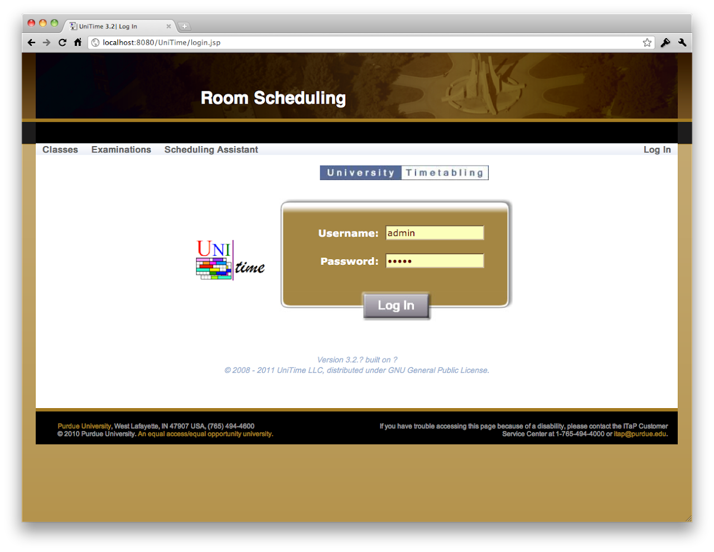
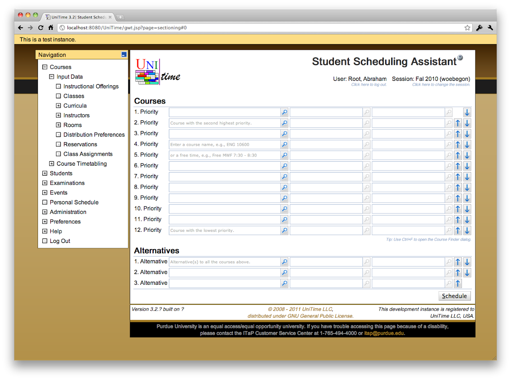
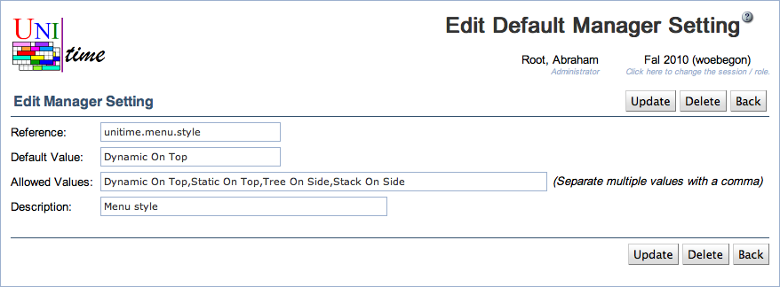

## Custom header & footer on login page


 There is an ability to provide custom header and footer on the login page. The following custom properties can be used to provide header and footer HTML snippets that are included on the login page.
```
tmtbl.header.external=custom/header.html
tmtbl.footer.external=custom/footer.html
```


 All the files needs to be included in the UniTime.war, e.g., in the custom folder.

## Welcome message


 A welcome message can be printed on the first page (when the user logs in).
```
tmtbl.system_message="Welcome to Woebegon College test suite."
```

## Warning message


 A (warning) message can be included at the top of each page.
```
tmtbl.global.warn="This is a demo version of the Timetabling application, all data entered here will be reset from a backup at 2:00am CET."
```


 This is also useful for schedule maintenance messages etc.

## Disclaimer message


 A disclaimer message can be added at the bottom of each page.
```
tmtbl.page.disclaimer="Woebegon University is an equal access/equal opportunity university.  If you have trouble accessing this page because of a disability,<br>please contact the IT Customer Service Center at 1-234-567-8888 or <a href="mailto:it@university.edu" class="unitime-FooterLink">it@university.edu</a>."
```


{:class='screenshot'}

## Custom style sheet


 A custom style sheet can be provided too, the changes are applied on top of the existing styles.
```
tmtbl.custom.css=custom/test.css
```


 Example style sheet:


{:class='screenshot'}
```
.unitime-Body {
        background: url("../custom/bg.png") #a37b2c repeat-x;
}
```


```
.unitime-Page {
        border: 1px solid #101010;
}
```


```
.unitime-Footer {
        border: 1px solid #101010;
        background-color: white;
}
```


```
.unitime-Footer td {
        padding-left: 3px;
        padding-right: 3px;
        padding-bottom: 2px;
        padding-top: 2px;
}
```


```
.unitime-FooterText {
        color: #101010;
}
```


```
a.unitime-FooterLink:link,a.unitime-FooterLink:visited,a.unitime-FooterLink:active,a.unitime-FooterLink:hover {
        color: #a37b2c;
}
```


```
.unitime-Disclaimer {
        color: #999;
        background-color: black;
        font-size: 9pt;
        border-top: solid 5px #a37b2c;
        margin: -1px;
        white-space: nowrap;
}
```


```
.unitime-MenuHeaderLabel {
        color: #101010;
}
```


```
.unitime-MenuHeaderOpen {
        border: 1px solid #101010;
        background-color: #FCDD89;
}
```


```
.gwt-DisclosurePanel .content {
        border-left: 1px solid #101010;
        border-bottom: 1px solid #101010;
        border-right: 1px solid #101010;
        padding-right: 5px;
        background-color: white;
}
```


```
.gwt-StackPanel {
        border-bottom: 1px solid #505050;
}
```


```
.gwt-StackPanel .gwt-StackPanelItem {
        border: 1px solid #505050;
}
```


```
.gwt-StackPanel .gwt-StackPanelContent {
        border: 1px solid #505050;
}
```


 See the latest [unitime.css](https://github.com/UniTime/unitime/blob/master/WebContent/styles/unitime.css) for the default custom style sheet.

## Menu style


 There are four different menu styles available.
```
unitime.menu.style=Dynamic On Top
```


{:class='screenshot'}

* Dynamic On Top -- Horizontal menu on the top of the page that moves with the window as the page is scrolled down.

* Static On Top -- Same meny as Dynamic On Top, but it is included in the page (it does not scroll with the page).

* Tree On Side -- Tree menu on the left side of the page, most closest to the menu in UniTime 3.1. It is fully collapsable and scrolls down with the page.

* Stack On Side -- Similar to the tree menu, but only one top section of the menu (Courses, Students, Examinations, ..) can be opened at a time. It is fully collapsable and scrolls down with the page.


 This property can be also set in Administration > Defaults > [User Settings](default-manager-settings) (like it is in the UniTime demo). In this case, every user can change its menu style using Preferences > [Settings](manager-settings).

## Other customizations


 There are many other customizations available, see [application.properties](https://github.com/UniTime/unitime/blob/master/JavaSource/application.properties) for suggestions. Most of the settings can be seen and changed using Administration > Defaults > [Configuration](application-configuration) page. For instance see [Examination Naming Conventions](exam-naming-convention) or [Custom Room Availability](custom-room-availability).
