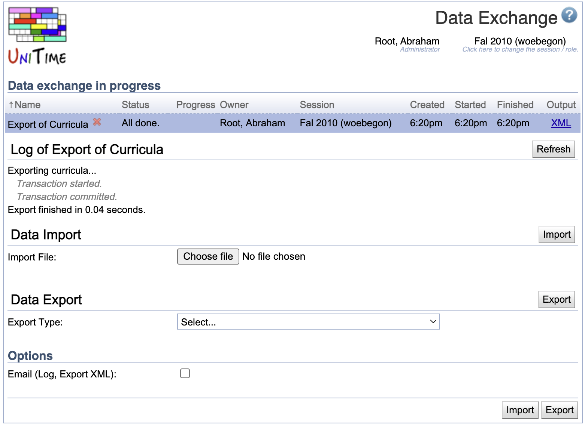

## Screen Description

The Data Exchange page can be used to import and export XML files.

{:class='screenshot'}

## Details

The various XML interfaces are described at [XML Interfaces](xml). It is also possible to call the Data Exchange programmatically using the [Data Exchange API](manuals/api#9data-exchange).

If multiple exports or imports are initiated at once, they will all show in the **Data exchange in progress** table and will be executed one by one. Select the appropriate export/import to see the log. Click the **Refresh** button to refresh the log.

### Data Import

Choose an XML file and click **Import**.

See the [XML Interfaces](xml) for the supported XML formats.

* In most cases, the existing data (for the selected academic session) is replaced by the content of the given XML file.
    * A lot of XML imports can also be run in the incremental mode (only listed elements are updated). To enable this feature, the `incremental` attribute must be set to `true` in the supporting XML file (typically on the root element of the XML document).
* Buildings and rooms are imported as external buildings and rooms; you need to use the Update Data operation on the [Buildings](buildings#update-data) page (menu Administration > Academic Sessions > Buildings) for the buildings and rooms to show up in the application.
* Staff is imported into the staff table. To pull in the instructors, use the [Manage Instructor List](manage-instructor-list) operation on the [Instructors](instructors) page (menu Courses > Input Data > Instructors).
* It is also possible to import a GZipped file, the extension must be `.xml.gz` in this case (or `.dat.gz` for the academic session import).
* It is also possible to import multiple files at once, if the import file is a ZIP file (with the `.zip` extension) containing one or more XML files. The files are imported in the order they are listed in the ZIP file. There must be only files that can be imported in the ZIP file and no.

### Data Export

Select the type of data for export and click **Export**.

Most of the available export types are the same XML formats that can be imported (see [XML Interfaces](xml) for more details). The **Academic Session** is the exception, which creates a binary file that can be used to copy the whole academic session (except for special events and not-committed course timetabling solutions) from one UniTime instance to another, or to duplicate an existing academic session by reimporting the exported session file.

### Options

When the **Email** option is checked, the data exchange log and the exported file (in the case of the export) will be emailed at the provided email address once done.
