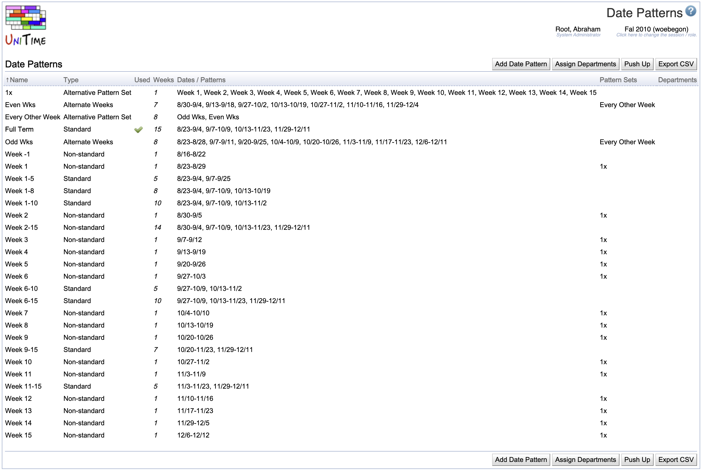

## Screen Description

The Date Patterns screen contains a list of date patterns for a given academic session.

{:class='screenshot'}

A date pattern defines a set of dates associated with a term when a class may meet. The actual meeting times of a class are computed as a projection of a time pattern onto a date pattern (e.g., a class that is taught on Tuesdays and Thursdays meets on all dates from the date pattern that are on Tuesday and Thursday). Normally, a date pattern should contain all dates of particular weeks (e.g, Week 1-4 contains all dates between Monday of the first week and Sunday of the 4th week). Date patterns consist of dates rather than weeks in order to allow institutions to shift weeks around holidays.

## Details

The list of date patterns contains the following information

* **Name**
	* Name of the date pattern

* **Type**
	* Type of the date pattern (Standard, Alternate Weeks, Non-Standard, Extended)
		* These types may be helpful for organizing the list of date patterns.
			* On classes and scheduling subparts, date patterns are ordered based on these types (Standard date patterns first, then Alternate Weeks, etc.)
		* If the type is Extended, only explicitly indicated departments (and administrators) have access to this date pattern (these are not visible as options on classes and scheduling subparts that are managed by departments not listed on these date patterns)

* **Used**
	* Checked if the date pattern is being used for some class
		* It is not possible to delete a date pattern if it is being used

* **Dates**
	* Dates that constitute this date pattern

* **Departments**
	* Departments that have access to this date pattern if the date pattern is of type Extended (if the type is not Extended and the date pattern is visible, all departments have access to it)

The date patterns not usable for a given academic session are in gray letters (to make a date pattern not usable click on it and untoggle option visible).

## Operations

* **Add Date Pattern**
	* Add a new date pattern in the [Add Date Pattern](add-date-pattern) screen

* **Assign Departments**
	* After a roll forward of an academic session, find classes that have an extended date pattern and authorize the departments of these classes to use these date patterns

* **Push Up**
	* After a roll forward of an academic session, if preferences were rolled forward on the class level, for each scheduling subpart that has all classes with the same date pattern, apply the date pattern push the date pattern up to the scheduling subpart

* **Export CSV**
	* Export the list of date patterns into a CSV file that can be easily open in Excel

