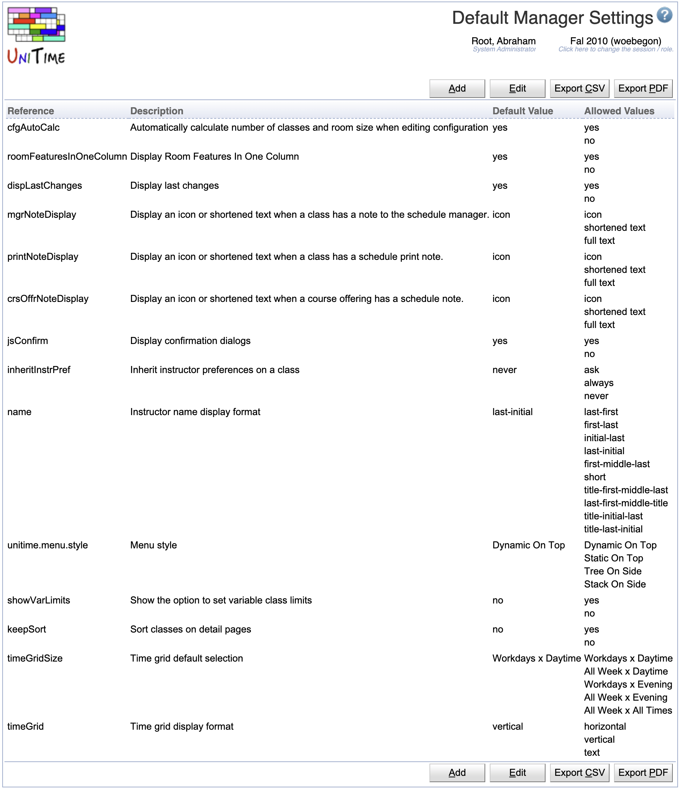
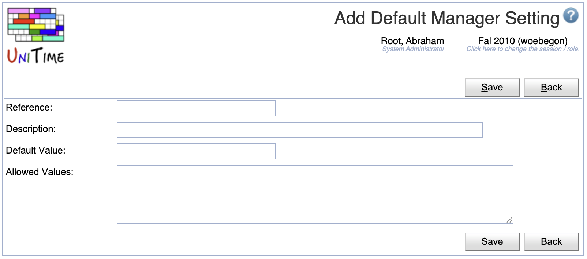
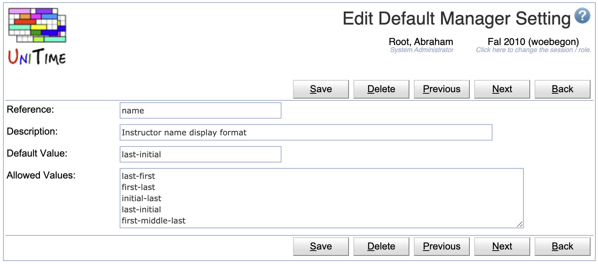
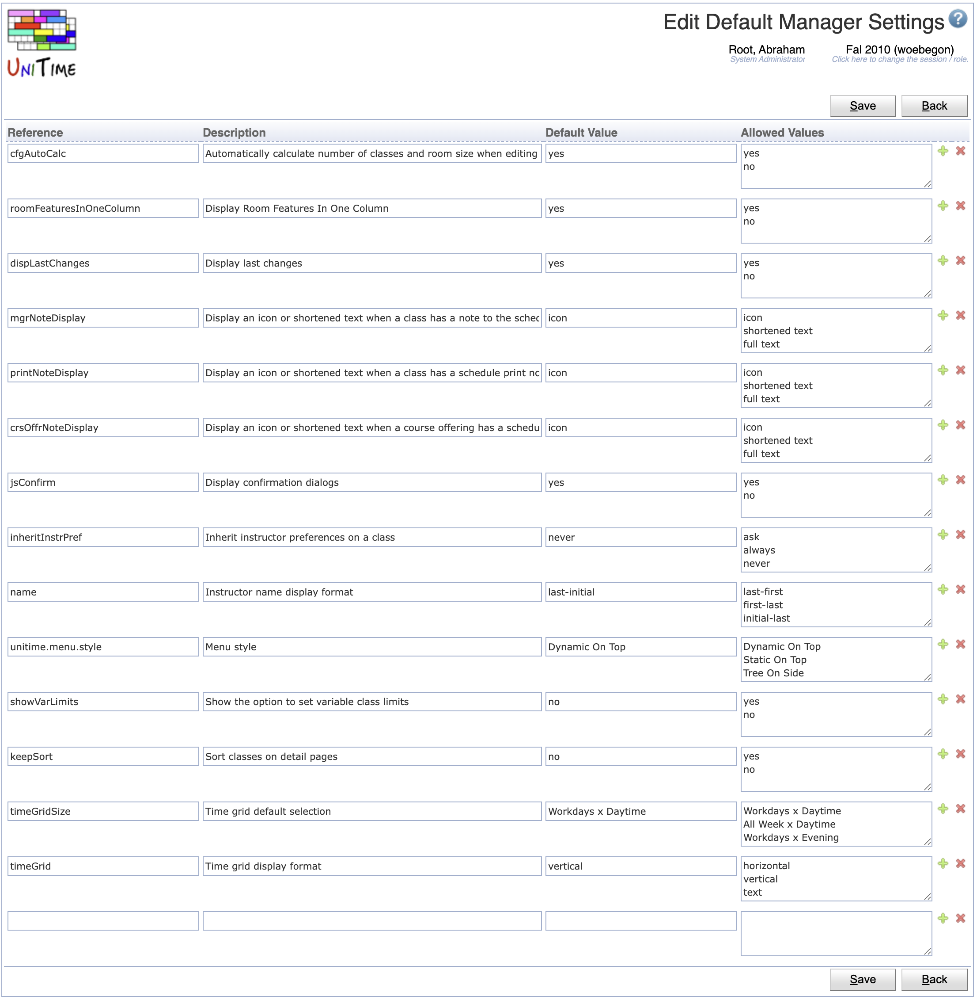

## Screen Description

The Default Manager Settings screen provides a list of settings that the schedule managers can change in the [Manager Settings](manager-settings) screen together with the default values.

{:class='screenshot'}

**Note:** All settings should be first implemented and recognized by the application before they are added to this list. Most of them are listed in the [UserProperty](https://github.com/UniTime/unitime/blob/master/JavaSource/org/unitime/timetable/defaults/UserProperty.java#L27) enum.

## Details

* **Reference**
	* The name of the setting as recognized by the application

* **Description**
	* The description that is displayed in the [Manager Settings](manager-settings) screen (accessible by all timetable managers)

* **Default Value**
	* The default value of the setting

* **Allowed Values**
	* List of all possible values of the setting
	* Can be localized by providing ```value:label``` on each line

## Operations

The table can be sorted by any of its columns, just by clicking on the column header and the sorting option that opens.

### Add Default Manager Setting
Click **Add** to add a new default manager setting

{:class='screenshot'}

* Click **Save** to create a new default manager setting
* Click **Back** to return to the list without making any changes

### Edit Default Manager Setting
Click a particular default manager setting to make changes or to delete the default manager setting

{:class='screenshot'}

* Click **Save** to make changes, **Back** to return to the list without making any changes
* Click **Previous** or **Next** to save the changes and go to the previous or next default manager setting respectively
* Click **Delete** to delete the default manager setting

### Edit Default Manager Settings
Click **Edit** to edit all default manager settings

{:class='screenshot'}

* Use the  icon to add a new line and  to delete a line
* Click **Save** to make changes, **Back** to return to the list without making any changes

### Export CSV/PDF
Click the **Export CSV** or **Export PDF** to export the list of default manager settings to a CSV or PDF document respectively