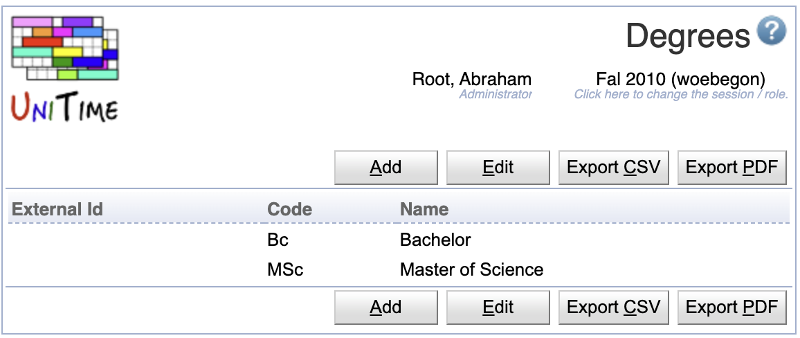
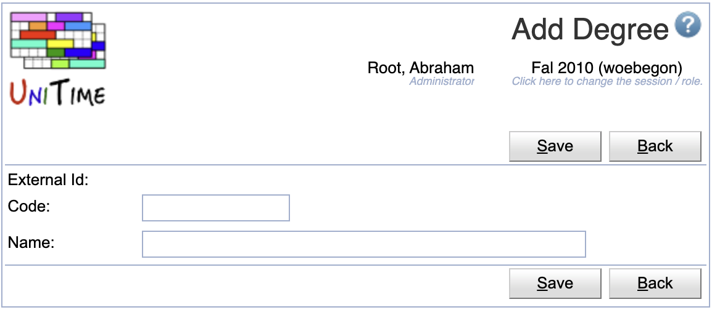
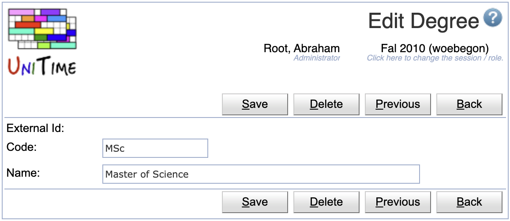
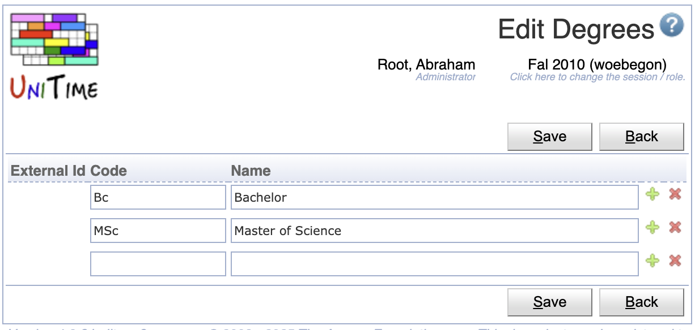

## Screen Description

The Degrees screen displays and allows editing of the list of available degrees for the current academic session.

{:class='screenshot'}

Degrees are one of the **optional** student curricular properties. Student curriculum may contain the following items:

* [Academic Area](academic-areas) (e.g., college or program of study)
* [Academic Classification](academic-classifications) (e.g., year or semester of study)
* [Major](majors) (e.g., specialization)
* [Concentration](concentrations) (optional, e.g., program/specialization variant)
* [Campus](campuses) (optional)
* [Degree](degrees) (optional, e.g., Master, Bachelor or Certification)
* [Program](programs) (optional)

or

* [Academic Area](academic-areas) (e.g., college or program of study)
* [Academic Classification](academic-classifications) (e.g., year or semester of study)
* [Minor](minors)

A student may contain multiple tuples of (academic area, classification, major, concentration, campus, degree, program) and/or (academic area, classification, minor).

## Properties

Each degree contains the following properties:

* External Id
	* External ID of the degree
	* External IDs are only editable via the [XML import](https://www.unitime.org/uct_interfaces.php)
	* Degrees with an external ID cannot be deleted. The presence of the External ID indicates that the degree has been imported from an external system.

* Abbreviation
	* Degree abbreviation

* Name
	* The name of the degree

## Operations

The table can be sorted by any of its columns, just by clicking on the column header and the sorting option that opens.

### Add Degree
Click **Add** to add a new degree

{:class='screenshot'}

* Click **Save** to create a new degree
* Click **Back** to return to the list without making any changes

### Edit Degree
Click a particular degree to make changes or to delete the degree

{:class='screenshot'}

* Click **Save** to make changes, **Back** to return to the list without making any changes
* Click **Previous** or **Next** to save the changes and go to the previous or next degree respectively
* Click **Delete** to delete a degree. Degrees with an external ID (i.e., that has been imported from an external system) cannot be deleted.

### Edit Degrees
Click **Edit** to edit all Degrees

{:class='screenshot'}

* Use the  icon to add a new line and  to delete a line
* Degrees with an external ID (i.e., that has been imported from an external system) cannot be deleted
* Click **Save** to make changes, **Back** to return to the list without making any changes

### Export CSV/PDF
Click the **Export CSV** or **Export PDF** to export the list of degrees to a CSV or PDF document respectively