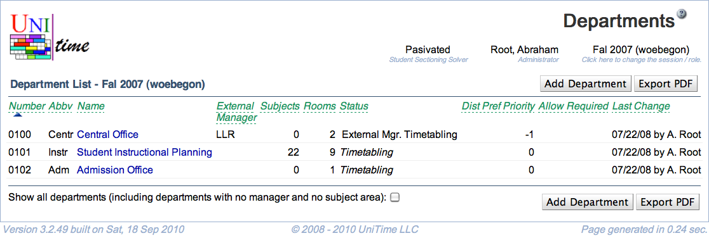

## Screen Description

The Departments screen contains a list of departments. Click on any department to edit its details.

{:class='screenshot'}

## Details

The top line contains the session for which the list is valid. You can change the session from the [Academic Sessions](academic-sessions) screen.

The list of departments consists of the following columns

* **Code**
	* The departmental number (may be the departmental ID within the university)
	* Used in imports/exports (corresponds to the "department" element in the XML staff file)

* **Abbreviation**
	* Abbreviation of the department

* **Name**
	* Name of the department

* **External Manager**
	* The abbreviation of the external manager if the department externally manages classes

* **Subjects**
	* Number of subject areas associated with the department

* **Rooms**
	* Number of rooms available to this department for timetabling

* **Status**
	* Status of the department (see possible values in the description of the [Edit Department](edit-department) screen)

* **Distribution Preference Priority**
	* A distribution preference set up between different departments is applied to the department with the highest number
	* This priority should correspond with the order in which the problems are being solved (e.g., large rooms first, then all departmental problems, then computing labs)

* **Allow Required**
	* By default, the departmental schedule managers of regular departments cannot use required/prohibited when setting preferences for the classes managed by an external manager
	* "Required/Prohibited" can be allowed for time preferences, room preferences, or both in the [Edit Department](edit-department) screen
		* If this "Required/Prohibited" property is set on a department that is marked as external manager, anyone that is allowed to change a class can set required/prohibited preferences on it; if the property is set on a department that is not marked as external manager, managers from that department can put required/prohibited preferences on any externally managed classes from their subject area(s).

* **Instructor Preferences**
	* If checked, instructor preferences should be automatically carried over to classes.

* **Events**
	* If checked, event management is enabled for this department.

* **Student Scheduling**
	* If checked, courses of this department should be included in student scheduling.

* **External Funding Dept**
	* If checked, the department can be used as an External Funding Department for classes.
		* This column is not visible by default.  To enable this column the unitime.courses.funding_departments_enabled application property must be set to true.

* **Last Change**
	* Date and name of the user who made the last change to input data associated with this department

* **Show all departments (including departments with no manager and no subject area)**
	* Check to display all departments
	* By default this is unchecked so that only departments that have some subject areas (and so timetabling can be done for them) are displayed

## Operations

* **Add Department** (Alt+D)
	* Add a new department to the list

* **Export PDF** (Alt+P)
	* Export the list of departments into a PDF document

