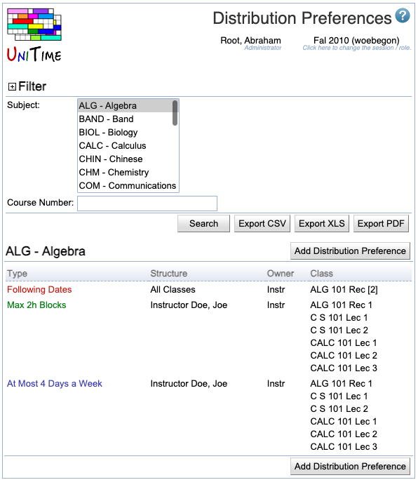

## Screen Description

The Distribution Preferences screen provides a list of existing distribution preferences. Distribution preferences are used if you want to have your classes distributed a certain way throughout the week (for example, classes should be back to back, or on the same days).

{:class='screenshot'}

## Details

If you have more than one subject area, you can either display distribution preferences for all subject areas (select "All" in the drop down list) or select a **Subject Area** in the drop down list in the top part of the screen. You can also filter by the **Course Number**. Click **Search** if you have changed any of these.

The list of distribution preferences has preferences for the subject area(s) and course number (if any). It can be sorted by any column - just click on the appropriate column heading in green letters. The columns are

* [Type](types-of-distribution-preferences)
	* Type of the preference (for example, Back-To-Back)

* [Structure](structure-of-distribution-preferences)
	* Structure of the preference (for example, All Classes)
	* If the distribution preference was added through instructor's preferences, the Structure is in the form of 'Instructor' and his/her name

* **Owner**
	* The manager during whose timetabling the preference will be applied - that depends on who timetables the classes in the distribution preference
		* If there are classes timetabled by different managers, the manager who timetables first "will not know" about the preference, the preference will be applied during the timetabling of the last manager (last to commit his/her timetable)
	* Note: distribution preferences which are put on instructors are taken into account during departmental timetabling only

* **Class**
	* Classes in the distribution preference (if there is no number after the name of the scheduling subpart, the preference is put on the subpart level - so for example Lec 1 means the preference is on the first lecture while Lec means that the preference is for all lectures)

Click on any line with a distribution preference to go to the [Edit Distribution Preference](edit-distribution-preference) screen where you can edit it.

## Operations

* **Export PDF** (Alt+P)
	* Export the screen to a PDF document (read more about the export in the description of the [Instructional Offerings](instructional-offerings) screen)

* **Add Distribution Preference** (Alt+A)
	* Go to the [Add Distribution Preference](add-distribution-preference) screen to add a new distribution preference

## Notes

A list of possible types of distribution preferences with their description can be found at [Types of Distribution Preferences](types-of-distribution-preferences), options for the structure and their description at [Structure of Distribution Preferences](structure-of-distribution-preferences).

