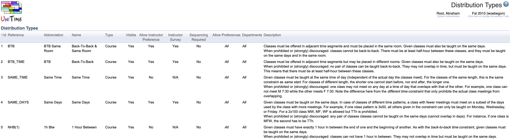
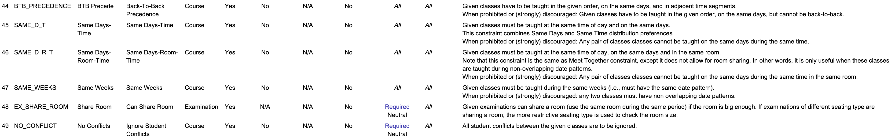

## Screen Description

The Distribution Types screen lists all the distribution types that can be used in the [Distribution Preferences](distribution-preferences) screen. Click on any type to edit information which is then displayed in the [Distribution Preferences](distribution-preferences) screen.

{:class='screenshot border-top border-sides'}
{:class='screenshot border-bottom border-sides'}

## Details

The list of distribution types contains the following information about each type
* **Id**
    * ID of the distribution type
* **Reference**
    * The name under which the solver recognizes the distribution type (cannot be edited via the timetabling application)
* **Abbreviation**
    * Abbreviation of the distribution type (listed e.g. in the drop down list in the [Distribution Preferences](distribution-preferences) screen or in [Instructional Offerings](instructional-offerings))
* **Name**
    * Name of the distribution type
* **Type**
    * Type of the problem for which the distribution is implemented (Course or Examination)
* **Visible**
    * "Yes" if the constraint is visible
* **Allow Instructor Preference**
    * If "Yes", this distribution type can be used for setting up distribution preferences for an instructor in the [Instructor Preferences](instructor-preferences) screen
* **Instructor Survey**
    * "Yes" if the constraint is visible on the [Instructor Survey](instructor-survey) screen
* **Sequencing Required**
    * Yes - the order of classes in the distribution preference with this distribution type matters (for example, for the type Precedence)
    * No - the order of classes does not matter (for example, for the type Same Room)
* **Allow Preferences**
    * The level(s) of preferences that should be allowed for this distribution type
* **Departments**
    * Departments that have access to a given distribution type
* **Description**
    * Description of the distribution type as displayed in the [Distribution Preferences](distribution-preferences) screen

To change properties of a distribution type, click on the appropriate line.

See [Additional Distribution Constraints](additional-distribution-constraints) for the list of additional distribution types that can be imported.