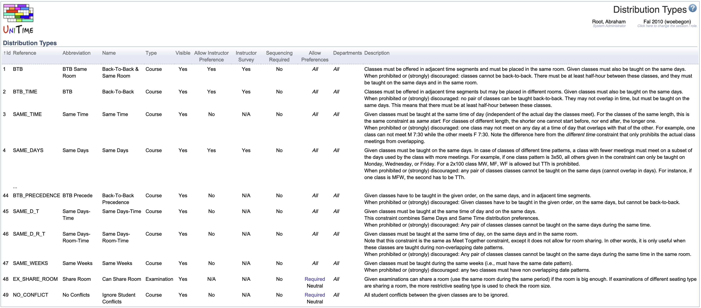
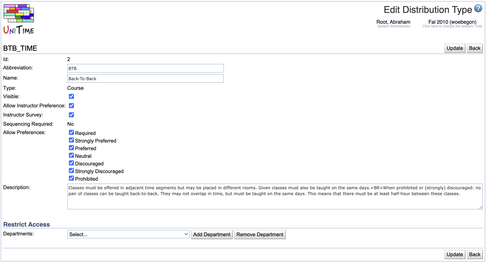

## Screen Description

The Distribution Types screen lists all the distribution types that can be used in the [Distribution Preferences](distribution-preferences) screen. Click on any type to edit information, which is then displayed in the [Distribution Preferences](distribution-preferences) screen.

{:class='screenshot'}

## Details

The list of distribution types contains the following information about each type
* **Id**
    * ID of the distribution type
* **Reference**
    * The name under which the solver recognizes the distribution type (cannot be edited via the user interface)
* **Abbreviation**
    * Abbreviation of the distribution type (listed e.g. in the drop-down list in the [Distribution Preferences](distribution-preferences) screen or in [Instructional Offerings](instructional-offerings))
* **Name**
    * Name of the distribution type
* **Type**
    * Type of the problem for which the distribution is implemented (**Course** or **Examination**, cannot be edited via the user interface)
    * Distribution types of the **Examination** type are used for the examination timetabling and do appear on the [Examination Distribution Preferences](examination-distribution-preferences) screen instead of the [Distribution Preferences](distribution-preferences) screen
* **Visible**
    * "Yes" if the constraint is visible (can be used on the [Distribution Preferences](distribution-preferences) when a new distribution preference is being created)
* **Allow Instructor Preference**
    * If "Yes", this distribution type can be used for setting up distribution preferences for an instructor in the [Instructor Preferences](instructor-preferences) screen
    * When changed to "No", existing preferences of this type will remain on the instructors, but it will not be possible to add a new distribution preference of this type
* **Instructor Survey**
    * "Yes" if the constraint is visible on the [Instructor Survey](instructor-survey) screen
* **Sequencing Required**
    * Yes - the order of classes in the distribution preference with this distribution type matters (for example, for the type Precedence)
    * No - the order of classes does not matter (for example, for the type Same Room)
    * Cannot be edited on the Edit Distribution Type screen
* **Allow Preferences**
    * The level(s) of preferences that should be allowed for this distribution type
* **Departments**
    * Departments that have access to a given distribution type
    * If no departments are provided, the distribution type is available to all departments
* **Description**
    * Description of the distribution type as displayed in the [Distribution Preferences](distribution-preferences) screen

While new distribution types can be created directly through the user interface, they can also be imported. See [Additional Distribution Constraints](additional-distribution-constraints) for the list of additional distribution types that can be imported.

## Operations

Click on the column name to sort the table by that column. The second click on the same column will reverse the order.

### Edit Distribution Type

To change properties of a distribution type, click on the appropriate line.

{:class='screenshot'}

On the Edit Distribution Type screen, you can edit the information displayed about the type of distribution preference and/or limit access to that preference to certain departments. You cannot redefine what a distribution preference does.

#### Restrict Access

* If no department is listed, all departments can use this distribution type
* Select a department from the drop-down list and click **Add Department** to indicate to which department the access should be restricted (more than one department can be added)
* Select a department from the drop-down list and click **Remove Department** to remove a department from the list of departments with restricted access

#### Operations

* Click **Update** to save changes and go back to the list of distribution types
* Click **Back** to go back to the list of distribution types without saving any changes
