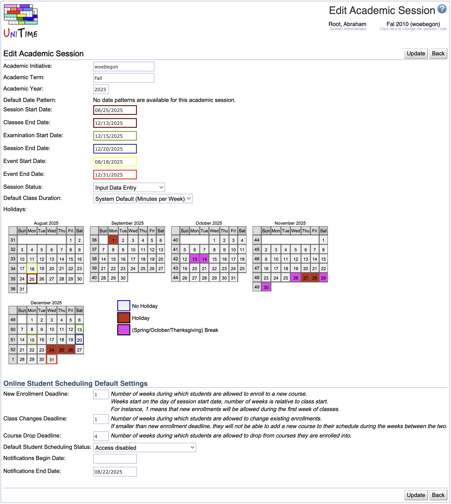

## Screen Description

The Edit Academic Session screen provides interface for changing properties of an academic session.

{:class='screenshot'}

## Details

* **Academic Initiative**
	* Name of the academic initiative (for example, a campus within a university)

* **Academic Term**
	* Term (semester) of this academic session

* **Academic Year**
	* Year of this academic session

* **Default Date Pattern**
	* Select which date pattern should be the default one out of all the date patterns available for a given session (you can see the available date patterns in the [Date Patterns](date-patterns) screen when you are in the given academic session)
	* After you create an academic session, you need to create or roll forward date patterns in order to have any date patterns available. To roll forward date patterns, use [Roll Forward Session](roll-forward-session) page.

* **Session Start Date**
	* The date when the session begins

* **Classes End Date**
	* The date when classes end

* **Examination Start Date**
	* First date of final examinations

* **Session End Date**
	* The date when session ends (for example, a session can end after final exams, a week after the classes end)

* **Events Start Date**
	* First date for which events can be entered for this academic session

* **Events End Date**
	* Last date for which events can be entered for this academic session

* **Session Status**
	* The statuses are defined in the [Status Types](status-types) screen
	* The default academic session statuses are
		* **Initial Data Load**: Used during data import or session roll-forward. Departmental managers do not have access.
		* **Input Data Entry**: Used during input data entry for the courses and examinations. The departmental schedule managers can edit input data and run the solver, but they cannot commit a timetable.
		* **Timetable**: Used during course timetabling. The departmental managers can edit data, create and commit timetables.
		* **Examination Timetabling**: Used during examination timetabling. Examination managers can make changes to the examinations and run the solver.
		* **Timetable Published**: Only admins can make schedule changes. Other users can see the course and examination timetables in the Events.
		* **Session Finished**: Academic session is no longer being used. Most users do not have access.

* **Default Class Duration**
	* Set the default class duration type for this academic session
	* _Minutes per Week_ is used by default
		* This is the existing behavior, where the minutes per week equals to the number of meetings times the minutes per meeting.
	* See [Class Duration Types](class-duration-types) for more detail

* **Default Instructional Method**
	* Default instructional method for this academic session
	* Used in the Scheduling Assistant to allow students to put a preference on instructional configurations without an instructional method selected
	* Instructional methods are defined in the [Instructional Methods](instructional-methods) screen
	* This option is not available when no instructional methods are defined

* **Holidays**
	* Indicate holidays and breaks within the academic session by clicking on the colored squares in legend and then on dates in the calendar (classes are not held on these days)

### Online Student Scheduling Default Settings

* **Deadline**
	* Deadlines are related to online student scheduling
	* **New Enrollment Deadline**
		* Deadline for allowing students to enroll in a new course
	* **Class Changes Deadline**
		* Deadline for allowing students to make a change in a course they are already enrolled in (e.g. move to a different section)
	* **Course Drop Deadline**
		* Deadline for allowing students to drop a course

* **Default Student Scheduling Status**
	* Default student scheduling status (no restrictions set by default)
	* Student scheduling statuses are defined in the [Student Scheduling Status Types](student-scheduling-status-types) screen

* **Email Notifications**
	* Optional start and/or end dates for student schedule change email notifications sent to instructors and students

## Operations

* **Update**
	* Save changes and go back to the [Academic Sessions](academic-sessions) screen

* **Delete**
	* Delete the academic session go back to the [Academic Sessions](academic-sessions) screen
	* There always has to be at least one academic session left. It is not allowed to delete the currently selected academic session.
	* Please note that you need to change the status of the academic session to Session Finished first as active sessions cannot be deleted.

* **Back**
	* Go back to the [Academic Sessions](academic-sessions) screen without saving anything

